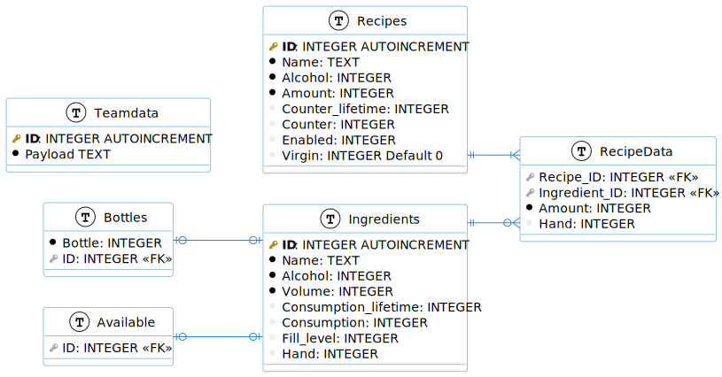
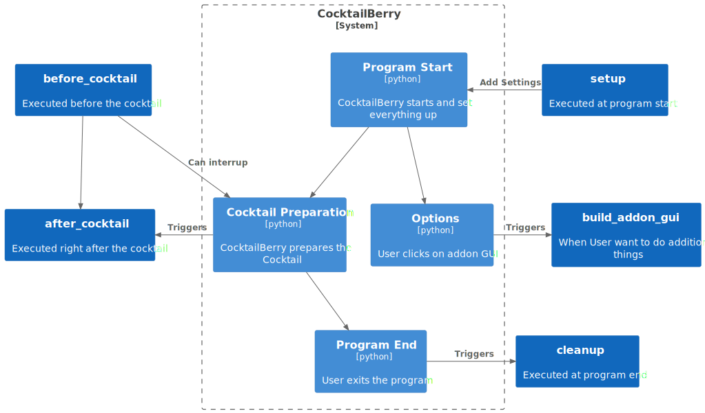

# Dev Notes <!-- omit in toc -->

This is an additional section for information, generally not relevant for the user but the developers. Here you will find some pitfalls and useful information discovered during coding.

## TOC  <!-- omit in toc -->

- [Python Version](#python-version)
- [Starting developing](#starting-developing)
  - [Installing dependencies](#installing-dependencies)
  - [Running the Application](#running-the-application)
- [DB Schema](#db-schema)
- [Addon Schema](#addon-schema)
- [Translating the UI](#translating-the-ui)
- [Other Hardware than RPi](#other-hardware-than-rpi)
- [Templates](#templates)
  - [German: API-Key](#german-api-key)
  - [PyQt](#pyqt)
    - [QT Template Files](#qt-template-files)
    - [Batch Compile Files](#batch-compile-files)
    - [Creating Styles](#creating-styles)
    - [Button clicked.connect behavior](#button-clickedconnect-behavior)
    - [Those God Damn Buttons](#those-god-damn-buttons)
    - [Scaling an App for High Resolution](#scaling-an-app-for-high-resolution)
- [Outdated Section](#outdated-section)
  - [Program Schema](#program-schema)

# Python Version

Currently used version (just use uv and see .python-version file):

```
Python Version 3.13.x
```

In the past, there were some issues due to not using the same Python version during development (PC) and at production (RPi). To prevent those issues, the same Python version (up to minor) like the current one shipped with the RPi system should be used. This will prevent making errors like using `list` instead of `List` for type hints (only works at Python 3.9+) and other features not yet available in the default RPi Python. Please use an according Python version for your local development.


# Starting developing

At the first time, you need to install the dependencies first.

## Installing dependencies

For Python, [uv](https://docs.astral.sh/uv/) is used.
For the frontend, [nodejs](https://nodejs.org/en) (v20) and [yarn](https://yarnpkg.com/) are used. 
Both are required to be installed on your system.
To install the Python dependencies, run:

```sh
uv install
```

To install the frontend dependencies, run:

```sh
cd web_client
yarn install
```

## Running the Application

If you use VSCode, you can use the provided settings to start the programs.
See under "Run and Debug" -> According options.
Otherwise, you can run the following commands:

```sh
uv run fastapi dev ./src/api/api.py
# or (windows)
uv run fastapi dev .\src\api\api.py
```

For the frontend, run:

```sh
cd web_client
yarn dev
```

# DB Schema

In the following diagram, the DB Architecture is shown. The used DB is a SQLite DB.



**Notes:**

- Even if not all fields are mandatory (NOT NULL) they should be initiated with a value of 0, if no other value is desired. This may be changed in the future with a DEFAULT 0 setting. The CocktailBerry app does always assign a value to all fields, so this is only an issue when using a own script for additional data filling
- AUTOINCREMENT ID / PK are generated by SQLite and do not need to be provided when inserting data
- SQLite does not have the boolean type, so an integer representation of `0: false 1: true` was used. This is case in following columns:
  - Hand
  - Enabled
  - Virgin
- Counter / Consumption should be set to 0 when initiating
- The Recipes.Comment field is historical and will probably be removed in the future, since the new DataClass representation takes this job now. Some testing needs to be done to ensure a working app without this column. This can be left as an empty string or null.
- SQLite does only provides a small amount of [alter operations](https://www.sqlite.org/lang_altertable.html), which is also why some columns still got no default value (schema creation was without this constraint).

# Addon Schema

In the following diagram, the schema and interaction with the addons are shown.



# Translating the UI

One contribution, that does not require any programming skill is the possibility to add a translation to your language.
The language file for the backend and qt app is found in `src/language.yaml` for CocktailBerry, `web_client/src/locales/LANGUAGENAME` and in `dashboard/frontend/language.yaml` for the Dashboard. In the best szenerio, both files get the according translation. You can use any of the existing language to translate into your own language, in most cases english will probably be the best to use. Please add for every existing option a translation, following the current YAML schema. Using an [ISO 639-1](https://en.wikipedia.org/wiki/List_of_ISO_639-1_code) **two letter code** language codes is desired.

# Other Hardware than RPi

There is also the generic board option, which should work with a broad option of other boards.
They only need to be controllable over the GPIO interface, especially with [python-periphery](https://github.com/vsergeev/python-periphery).
Depending on the OS of the system, some set up steps may differ from the RPi ones.
For the Qt GUI its important to run the LXDE or similar Desktop variant.
Gnome or others may break some features like always stays on top or other window settings.

Example for RockPi:

```sh
# launcher
nmcli r wifi on
echo "Waiting for WiFi"
sleep 10
export QT_SCALE_FACTOR=1
cd ~/CocktailBerry/
uv sync --inexact --extra v1
sudo -E .venv/bin/python runme.py
# cocktail.desktop at "/etc/xdg/autostart/"
[Desktop Entry]
Type=Application
Name=CocktailScreen
Terminal=true
Exec=/usr/bin/lxterminal -e sh /home/rock/launcher.sh
```

# Templates

Here are some templates for processes in CocktailBerry

## German: API-Key

Hey USERNAME

Ich schreibe dir hier wegen dem API Key, damit alle Infos gesammelt kommen.
Die offizielle CocktailAPI ist optional, ich biete jedem mit einer Maschine die Nutzung an.

REGELN:
Prinzipiell gelten Regeln, die überall gelten. Sprich:

- Gib weder deiner Maschine noch den Cocktails irgendwelche diskriminierenden oder beleidigenden Namen, diese sind sichtbar, wenn Daten gesendet werden
- Behandle den Schlüssel wie ein Passwort, speichere ihn nicht im Code von Projekten, sondern nur einer .env Datei, die nicht mit git committed wird
- Falls der Schlüssel doch komprimiert wird, gib mir einfach Bescheid, ich lösche den aktuellen und generiere einen neuen

Sollten diese missachtet werden, wird der Schlüssel gelöscht.

INSTALLATION:
Um Daten zu senden, muss der Microservice installiert werden, dies geht entweder über den:

- neuen Weg https://cocktailberry.readthedocs.io/advanced/ -> verwende einfach die CLI

Dann im selben Ordner einfach 'docker-compose up --build --detach' (oder bei neuen auch 'docker compose up --build --detach') ausführen. Der Service startet dann immer automatisch mit dem System. Merke, dafür muss natürlich Docker + Compose installiert sein. In den CocktailBerry Optionen kannst du dann jederzeit mit dem Häkchen bei 'MICROSERVICE_ACTIVE' die Interaktion mit diesem an-/ausschalten. Wenn sich Änderungen am Code oder deiner .env ergeben, einfach den Befehl noch mal ausführen.

Die Daten sind dann auf dem Dashboard (https://stats-cocktailberry.streamlit.app/) zu sehen. Unter der Route https://stats-cocktailberry.streamlit.app/?partymode=true werden direkt nur Daten der letzten 24h angezeigt. Das ist für Gäste deiner Party nützlich, um live die Daten zu verfolgen.

BITTE BEI TESTS AUSSCHALTEN MIT EINER AUSNAHME
Bitte denke daran, dass wenn das Set-Up fertig ist, die Daten von produzierten Cocktails gesendet werden, oder temporär gespeichert und später gesendet werden, wenn keine Internetverbindung besteht. Das heißt: Wenn du Tests oder ähnliches machst, solltest du mindestens das Häkchen bei 'MICROSERVICE_ACTIVE' entfernen, damit nicht die Testdaten fälschlicherweise gesendet werden. Das Senden der Daten sollte nur geschehen, wenn auch ein "normaler" Betrieb der Maschine ist. Wenn du testen willst, ob der Key richtig
eingerichtet ist, kannst du einen neuen Cocktail mit dem Namen "testcocktail" (alles klein, Zutaten egal) erstellen und den zubereiten / an die API schicken. Cocktails mit diesem Namen werden alle 20 Minuten von der Datenbank gelöscht. Mit "docker logs cocktail-microservice" und in den CocktailBerry Logs können mögliche Fehler ausgelesen werden, um zu ermitteln warum der Service nicht wie gedacht funktioniert.

HALL OF FAME
Gerne füge ich auch deine Maschine in die „Hall of Fame“ hinzu. Diese ist auf https://stats-cocktailberry.streamlit.app/ unten bei „Existing Machines“. So können auch andere Nutzer sich von dir inspirieren lassen. Dafür benötige ich ein oder zwei aussagekräftige, gut belichtete Bilder von (am besten Vollansicht) der Maschine. Zudem einen Name (oder Alias) von dem Besitzer, als auch den Namen der Maschine, am besten den Gleichen, wie in den Optionen benannt. Gerne auch noch 2-5 Sätze in Deutsch/Englisch über die Maschine. Als Beispiele kannst du die schon existierenden Einträge anschauen.

EIGENER ENDPOINT
Alternativ existiert im microservice auch 'HOOK_ENDPOINT', wenn du die Daten lieber an einen eigenen Endpunkt senden willst. Mit 'HOOK_HEADERS' kannst du auch Authentifizierung und co. mitsenden. Ich verwende das zum Beispiel, um die Daten an mein Smarthome zu senden.
So als Tipp: Wird der Standardwert bei 'HOOK_ENDPOINT' / 'API_KEY' gelassen, oder der Variable ganz entfernt, sendet der Service dahin nichts, auch wenn er aktiv ist.

DER KEY
So, dein Key ist: APIKEY 😊

Viele Grüße und vor allem viel Spaß mit CocktailBerry
SENDERNAME

## PyQt

All Topics related to PyQt (or Qt in general).

### QT Template Files

We usually use QT ui template files (see `src/ui_elements/`) for the GUI design.
These files need to be compiled into python files, which can be used in the code.
It is generally discouraged to edit the ui files directly and use the qt-designer tool instead.

You can run the tool with:

```shell
uv run pyqt6-tools designer
```

### Batch Compile Files

Just use the Script:

```shell
.\scripts\compile_ui_to_python.ps1  
```

### Creating Styles

To manage the style, a qss (qt-css) file is used. [qtsass](https://github.com/spyder-ide/qtsass) is used to convert a sass file into the used qss file. For conversion run:

```bash
qtsass /src/ui/styles/ -o /src/ui/styles/  
```

If you want to implement a new style, copy the default.scss file, rename the copy to your style name and plug your colors into the variables. After that, just compile the file. You got a new style setting. To be supported, the style name needs to be added to the `src.__init__` file into the `SUPPORTED_STYLES` list.

### Button clicked.connect behavior

One issue, which is not clear on the first view, is that there are two signatures for this function. See [this issue on StackOverflow](https://stackoverflow.com/questions/53110309/qpushbutton-clicked-fires-twice-when-autowired-using-ui-form/53110495#53110495) for more details. When using the error logging wrapper and just passing the wrapped function into the connect function, PyQt will also emit the `False` argument into the wrapper. This will result in a crash of the program in case the wrapped function got no arguments. In this case it is better to use a lambda to explicitly tell PyQt the function got no arguments.

```Python
# Wrapped function without arguments
@logerror
def some_function():
  print("Doing Stuff")

# Good
your_button.clicked.connect(lambda: some_function())

# Will crash because the wrapper got *args=(False,)
# and will call some_function(False)
your_button.clicked.connect(some_function)
```

### Those God Damn Buttons

Even if buttons support a icon element, there seem no way to change the icon color over a css property.
You either change the icon file (lol) or adjust the color over the property.
Qtawesome got a color argument.
It could be used to change the color to the given theme color, but therefore some refactoring is needed.

Example:

```python
from PyQt6.QtCore import QSize
import qtawesome as qta
def _change_cog_icon(self):
    """Changes the option button icon"""
    self.option_button.setIcon(qta.icon("fa5s.cog", color="#007bff"))
    self.option_button.setIconSize(QSize(32, 32))
```

### Scaling an App for High Resolution

If the user uses a high res screen (like 2k+), this app will now work properly.
A possible solution is to divide the resolution by x (e.g. 2) and then set the QT_SCALE_FACTOR to x.
This will effectively run the App at the given lower res, but scale it up to fit the screen.
Example for powershell:

```powershell
$Env:QT_SCALE_FACTOR = "2"
uv run runme.py
```

# Outdated Section

Here are some topics which might be outdated or not relevant anymore.

## Program Schema

In the following diagram, the schema and classes / containers are displayed in a simplified version.

