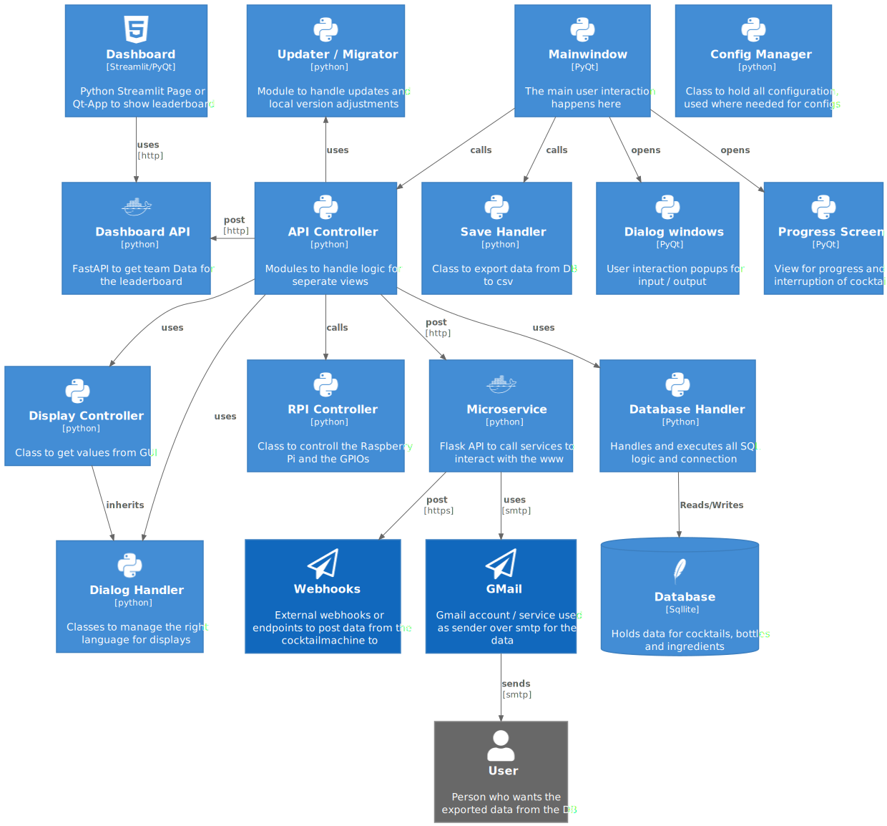

# Dev Notes <!-- omit in toc -->

This is an additional section for information, generally not relevant for the user but the developers. Here you will find some pitfalls and usefull information discovered during coding.

## TOC  <!-- omit in toc -->

- [Python Version](#python-version)
- [DB Schema](#db-schema)
- [Program Schema](#program-schema)
- [Translating the UI](#translating-the-ui)
- [PyQt](#pyqt)
  - [Batch Compile Files](#batch-compile-files)
  - [Creating Styles](#creating-styles)
  - [Button clicked.connect behaviour](#button-clickedconnect-behaviour)
  - [Those God Damn Buttons](#those-god-damn-buttons)
- [ToDos](#todos)
  - [In Planning](#in-planning)
  - [Backlog](#backlog)
  - [Done](#done)


# Python Version

Currently used version:

```
Python Version 3.7.x
```

In the past, there were some issues due to not using the same Python version during development (PC) and at production (RPi). To prevent those issues, the same Python version (up to minor) like the current one shipped with the RPi system should be used. This will prevent making errors like using `list` instead of `List` for type hints (only works at Python 3.9+) and other features not yet available in the default RPi Python. Please use an according Python version for your local development.

# DB Schema

In the following diagram, the DB Architecture is shown. The used DB is a SQLite DB.


**Notes:** 
- Even if not all fields are mandatory (NOT NULL) they should be initiated with a value of 0, if no other value is desired. This may be changed in the future with a DEFAULT 0 setting. The CocktaiBerry app does always asign a value to all fields, so this is only an issue when using a own script for additional data filling
- AUTOINCREMENT ID / PK are generated by SQLite and do not need to be provided when inserting data
- SQLite does not have the boolean type, so an integer representation of `0: false 1: true` was used. This is case in following columns:
  - Hand
  - Enabled
  - Virgin
- Counter / Consumption should be set to 0 when initiating
- The Recipes.Comment field is historical and will probably be removed in the future, since the new DataClass represantion takes this job now. Some testing needs to be done to ensure a working app without this column. This can be left as an empty string or null.
- SQLite does only provides a small amount of [alter operations](https://www.sqlite.org/lang_altertable.html), which is also why some columns still got no default value (schema creation was without this constraint).

# Program Schema

In the following diagram, the schema and Classes / Containers are displayed in a simplified version.



# Translating the UI

One contribution, that does not require any programming skill is the possibility to add a translation to your language.
The language file is found in `src/language.yaml` for CocktailBerry and in `dashboard/frontend/language.yaml` for the Dashboard. In the best szenario, both files get the according translation. You can use any of the existing language to translate into your own language, in most cases english will probably be the best to use. Please add for every existing option a translation, following the current YAML schema. Using an [ISO 639-1](https://en.wikipedia.org/wiki/List_of_ISO_639-1_code) **two letter code** language codes is desired.

# PyQt

All Topics related to PyQt (or Qt in general).

## Batch Compile Files

Just use the Script:

```shell
.\scripts\compile_ui_to_python.ps1  
```

## Creating Styles

To manage the style, a qss (qt-css) file is used. [qtsass](https://github.com/spyder-ide/qtsass) is used to convert a sass file into the used qss file. For conversion run:

```bash
qtsass /src/ui/styles/ -o /src/ui/styles/  
```

If you want to implement a new style, copy the default.scss file, rename the copy to your style name and plug your colors into the variables. After that, just compile the file. You got a new style setting. To be supported, the style name needs to be added to the `src.__init__` file into the `SUPPORTED_STYLES` list.

## Button clicked.connect behaviour

One issue, which is not clear on the first view, is that there are two signatures for this function. See [this issue on StackOverflow](https://stackoverflow.com/questions/53110309/qpushbutton-clicked-fires-twice-when-autowired-using-ui-form/53110495#53110495) for more details. When using the error logging wrapper and just passing the wrapped function into the connect function, PyQt will also emmit the `False` argument into the wrapper. This will result in a crash of the programm in case the wrapped function got no arguments. In this case it is better to use a lambda to explicitly tell PyQt the function got no arguments.

```Python
# Wrapped function without arguments
@logerror
def some_function():
  print("Doing Stuff")

# Good
yourbutton.clicked.connect(lambda: some_function())

# Will crash because the wrapper got *args=(False,)
# and will call some_function(False)
yourbutton.clicked.connect(some_function)
```

## Those God Damn Buttons

Even if buttons support a icon element, there seem no way to change the icon color over a css property.
You either change the icon file (lol) or adjust the color over the proverty.
Qtawesome got a color argument. 
It could be used to change the color to the given theme color, but therefore some refactoring is needed.

Example:
```python
from PyQt5.QtCore import QSize
import qtawesome as qta
def _change_cog_icon(self):
    """Changes the option button icon"""
    self.option_button.setIcon(qta.icon("fa5s.cog", color="#007bff"))
    self.option_button.setIconSize(QSize(32, 32))
```


# ToDos

Here are some todos, for now or later versions:

## In Planning

- [ ] Review microservice and its features
  - [ ] Email always is quite tricky, maybe get something more "working", or just remove it
  - [x] Generally review this logic, maybe extend it to make it work with other custom endpoints using keys are other header auth features
- [ ] Switch from strong private to weak private class methods
- [ ] Use a approach to change button color without needing new png / svgs files
  - [ ] Investigate if qtawesome can do the job
  - [ ] refactor styles to easier get color data

## Backlog

- [ ] Add possibilty to switch units for recipes
  - [x] Rework GUI fields to use dynamic instead of static values
  - [x] Dynamically change label depending on setting
  - [ ] Refactor app logic to work with different units
    - [ ] Make sure microservice always using ml as unit
    - [ ] Evaluate if it makes sense to change db values or just convert them for the frontend
  - [x] Rework input field validators
  - [x] Change number control field to floats
## Done

- [x] Add progress bar to cleaning programm and possibility to cancel
- [x] Add possibilty to import new recipes over CLI
  - [x] Add CLI command with filepath argument
    - [x] Use optional conservion (option) factor if units are not in ml
  - [x] Add parser for parsing recipe data
    - [x] Evaluate common file structure / type for parsing
  - [x] Add logic to populate DB
- [x] Extent RPi Controller API to be more generic for also other boards
  - [x] Introduce new config var to set board type
  - [x] Add list of supported board types to settings
  - [x] Extend documentation for pin names / numbers
  - [x] Check if setting is in list of supported types
  - [x] Refactor RPi to machine controller
  - [x] New board / pin controlller class for machine controller to inherit pin methods from
- [x] Add config management into maker UI
  - [x] replace cleaning with option button
  - [x] own window to have dedicated option settings
  - [x] Get all needed configs from manager
  - [x] Display with correct input option for user
  - [x] Check values before change
- [x] Switch from in file stylesheets to one central stylesheet
  - [x] Create method to inject stylesheet into ui
  - [x] Merge individual stylesheets into one central one
    - [x] Make it to work with any amount of urls / header things
    - [x] Make it work with the official API
  - [x] Review que logic for failed sending
  - [x] Add aditional logic for the new official endpoint + api key .env variable slot for example file
  - [x] Extend API for receiving as well as sending of language used and machine name
- [x] Add restart / reboot control into maker UI
- [x] Give the user the possibility to backup and restore CocktailBerry data
  - [x] Option in the UI to import/export data
  - [x] Prompt for user to choose folder for backup
  - [x] Generate own folder with db (and config) file
  - [x] *Optional:* possibility only to export one of both? -> will probably not make this
  - [x] Method / Class to overwrite existing files with backup ones
    - [x] Think of also deleting previously stored files in the backup if overwrite
- [x] Also Send Recipe Data (Ingredients) as Object to the Endpoint. Let the user handle the data.
