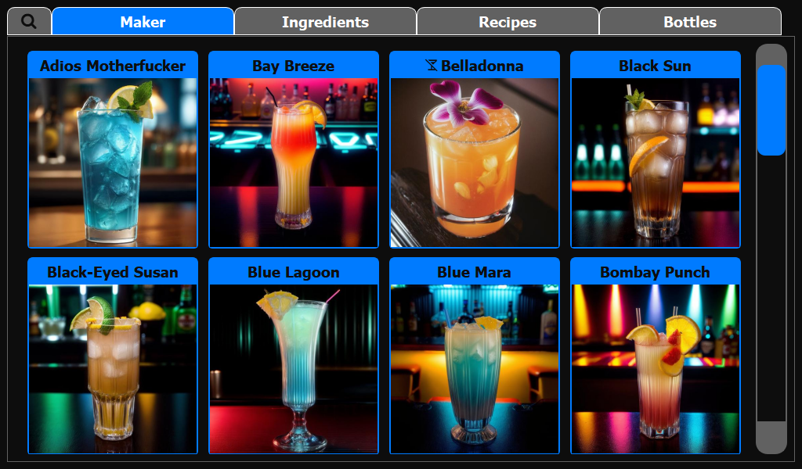
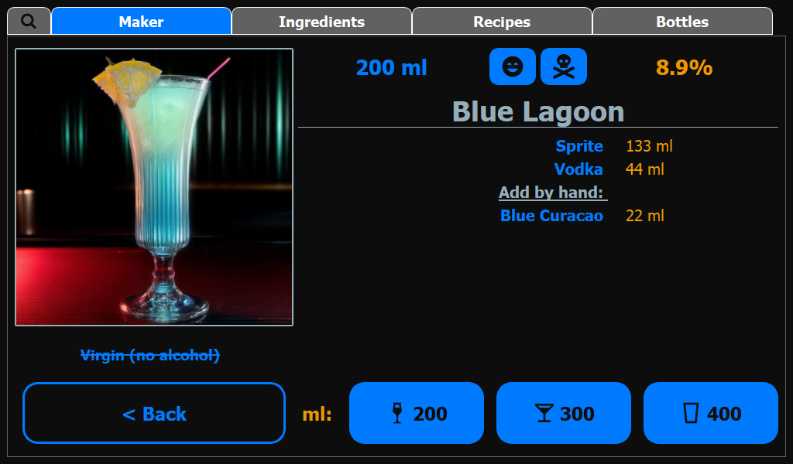
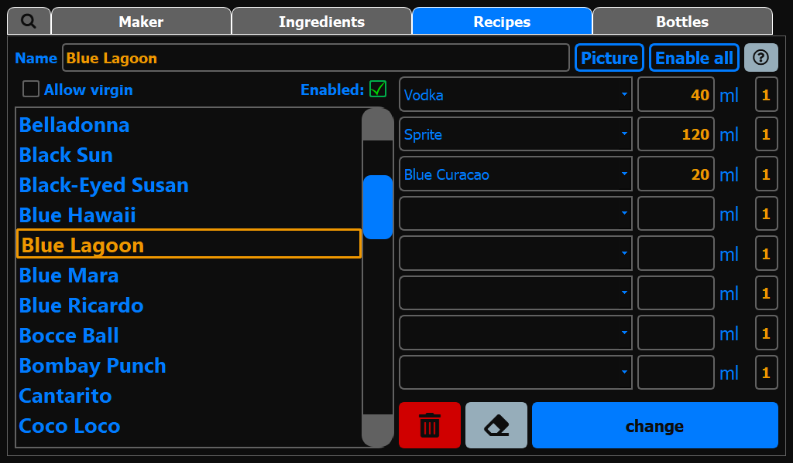
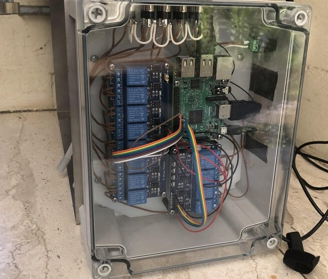

# Overview

This app is used to control a cocktail machine and easily prepare cocktails over a nice-looking user interface.
It also offers the option to create and manage your recipes and ingredients over the interface and calculates the possible cocktails to prepare over given ingredients.
Track and display cocktail data for different teams to even further increase the fun.
Have also a look into the [User Guide](assets/CocktailBerryUserGuide.pdf).
Let's get started!

## tl;dr

The too long; didn't read is, that you can easily install the software by just flashing the Raspberry Pi OS on a SD card, insert it, start the device and install the software with just one command.
Then, get some coffee and let the script do the work.
When you come back, you can set up the machine over the graphical user interface and start mixing cocktails.
This way, you don't have to know much about software an can go full focus on the hardware.
If you want to do your own software part, you can still add this over [addons](addons.md).

<figure markdown>
  { width="600" }
  <figcaption>User selects recipe > clicks button > cocktail is prepared > profit</figcaption>
</figure>

## Interface

The interface was programmed with PyQt5 for the users to easily interact with CocktailBerry and enter new ingredients/recipes. There are different views for the tasks.

<figure markdown>
  
  <figcaption>The Maker GUI</figcaption>
</figure>

<figure markdown>
  
  <figcaption>The Selection GUI</figcaption>
</figure>

This is the main window of the application and the window your guest will interact with.
They can choose a cocktail of their choice, a crossed glass at the end indicates that there is also a virgin option of this cocktail.
The cocktail data is displayed after selection.
The user can increase or decrease the volume, as well as the alcohol level of the cocktail.

<figure markdown>
  
  <figcaption>The Ingredient GUI</figcaption>
</figure>

Here you can manage all your ingredients.
Define the name, volume and alcohol level of each ingredient here.
Also, you can set ingredients for hand add and let CocktailBerry spend a single ingredient.

<figure markdown>
  
  <figcaption>The Recipe GUI</figcaption>
</figure>

Here you can manage all your recipes.
Define the name and ingredients with corresponding volume.
You can disable recipes, you currently don't want to serve, or activates the virgin option for a cocktail.
Also, additional ingredients added later by the user can be defined for a recipe.

<figure markdown>
  
  <figcaption>The Bottle GUI</figcaption>
</figure>

Here you can manage your connected ingredients.
Toggle the new button and apply a new ingredient if you change to a new bottle.
You can also change the current fill level of each bottle.
Use the gear icon to get to the option window.
Within this, you can export data, change settings, make and restore backups or reboot and shutdown the system.

## Example Machines

The base machine consists out of a Raspberry Pi + touchscreen, 5V relays as well as membrane pumps and some cabling.
MK1 is made with custom design housing out of bent, laser cut and welded stainless steel.
Mk2 as well as Mk3 is printed on a 3D printer.
But there may be some other custom-builds out there, check out the [official dashboard](https://stats-cocktailberry.streamlit.app/#existing-machines) for more impressions.
The electronics are hidden in a waterproof housing, the pumps are within the casing.
See [Hardware](hardware.md) for a detailed example list of components.

<figure markdown>
  {width="700"}
  <figcaption>Front View</figcaption>
</figure>

<figure markdown>
  {width="700"}
  <figcaption>Side View</figcaption>
</figure>