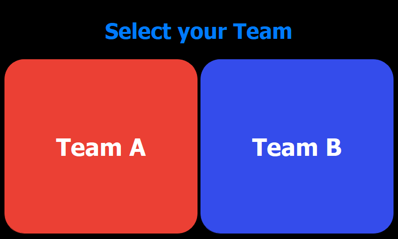
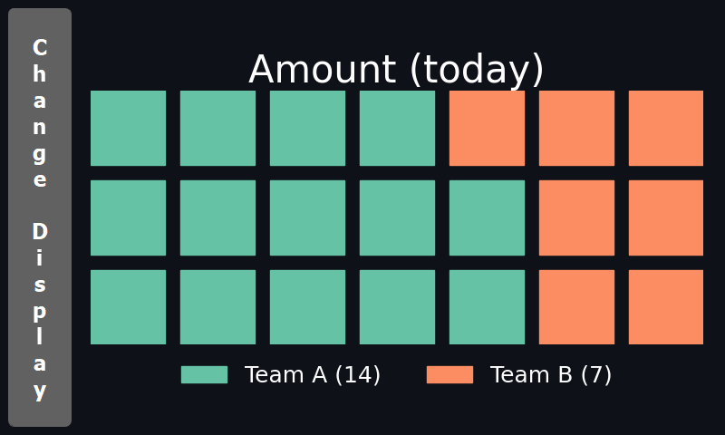

# Advanced Topics

!!! info "Optional Features"
    Take note that none of this section is required to run the base program.
    These are just some fun additions, which you can optionally use.
    If you are not interested in them, just skip this section.

## CocktailBerry Microservice

As a further addition, there is the option to run a microservice which handles some networking topics.
Currently, the service can:

- Post the cocktail data to a given webhook, adding header information
- Post the cocktail data to the official dashboard API, see [detailed description](#posting-data-to-the-official-api)

Cocktail data currently includes cocktail name, produced volume, ingredients, current time, used language in config and your machine's name.
Since the service runs along with CocktailBerry, you can just use the CLI for the setup:

```bash
uv run runme.py setup-microservice
```

The terminal will interactively ask you for the required information.
This also sets up [watchtower](https://containrrr.dev/watchtower/), which keeps the service image up to date.
See the [CLI documentation](commands.md#setup-the-microservice) for all options.

One example of the usage [can be found in my blog](https://andrewohnsland.github.io/blog/cocktailberry-now-with-home-assistant).
The service will also temporarily store the data within a database, if there was no connection to the endpoint, and try again later.
This way, no data will get lost in the void.

### Posting Data to the Official API

When the microservice is active, you can use it not only to send data to your own webhook, but also to the official [CocktailBerry data API](https://github.com/AndreWohnsland/CocktailBerry-Stats) and submit your data.
It will then appear on the [official dashboard](https://stats-cocktailberry.streamlit.app/).
Don't worry, no private data is included, only some cocktail data.
A detailed write-down [can be found on the dashboard site](https://stats-cocktailberry.streamlit.app/#how-to-participate) how you can receive your API key.
You need to change the default `API_KEY` value of the microservice to your own key.
After that, your CocktailBerry will be able to also submit data and help populate the dashboard.

## Dashboard with Teams

!!! warning "For Experienced Users"
    This is an advanced feature, and you should be familiar with some tinkering on the RPi and command shell.

CocktailBerry has an optional team feature.
If enabled within the config, the user can choose one of the defined teams to register the cocktail to.
The names of the teams, as well as the URL of the dashboard device, can be specified within the config.
CocktailBerry will then send the information to the team's API.

The Dashboard will use the API to display the current status.
You can use the number of cocktails or cocktail volume as metric.
In addition, there is the option to display all time data of the leader board.
By default, the latest 24 hours, so mostly this party, will be shown.
You should use a second device for the API / the dashboard for easy display on another screen.

<figure markdown>
  
  <figcaption>Teams Selection in CocktailBerry</figcaption>
</figure>

<figure markdown>
  
  <figcaption>Dashboard View for Teams</figcaption>
</figure>

The **recommended way** is to use a second Raspberry Pi with a touchscreen attached.
But you might also install everything on the same device, if you have enough resources.
For this case, I recommend at least a Raspberry Pi 4 with 2GB RAM.
In addition, docker and compose need to be installed on the device.

!!! tip "More Flexibility"
    Both of these images are also available at [Docker Hub](https://hub.docker.com/search?q=andrewo92), so if you want to tweak them, you can just use the pre-built image.
    Create the according `docker-compose.yaml` file on your desktop, or in a separate location.
    In `CocktailBerry/dashboard` you will find the `docker-compose.both.yaml` file, which you can also use as a template.

### Teams on Secondary Device

On a second Raspberry Pi, the easiest way is to use the provided shell script:

```bash
cd ~/CocktailBerry
sh scripts/setup.sh dashboard
# follow the instructions
```

!!! danger "Important"
    **Please do not use the script on the same Device as CocktailBerry!** It will otherwise overwrite the CocktailBerry autostart.

### Teams on Same Device

If you want to run the teams service on the same device as CocktailBerry, you can use the CocktailBerry CLI (needs CocktailBerry to be installed):

```bash
uv run runme.py setup-teams-service -l de # (1)!
```

1. Use one of the supported languages here

Since you will have only one screen, use a secondary device to access the dashboard.

### Accessing the Dashboard

You can access the frontend on a web browser, either over:

- **http://127.0.0.1:8050** Your browser directly at the RPi
- **http://YOUR_PI_IP:8050** The IP address of the Pi from another device, if devices are in the same network

The setup script will also configure the second device to automatically open the dashboard in a kiosk browser at start.

### Using the Dashboard as a Hotspot

You can also set the second device up as a Wi-Fi hot-spot.
This will give you the possibility to always connect to the dashboard, even if no connection to another home network or internet is available.
For this, a very easy way is to use [RaspAp](https://raspap.com/).

## Installing Docker

Docker and compose are needed for the microservice and dashboard features.
The provided scripts `sh scripts/install_docker.sh` and `sh scripts/install_compose.sh` will install both for you.
If you used the all-in-one script at the setup of your CocktailBerry, docker is most likely already installed.
