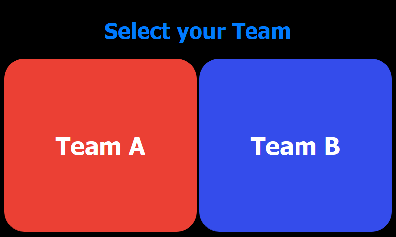

# Advanced Topics

!!! success "First Of All"
    Take note that none of this section is required to run the base program.
    These are just some fun additions, which you can optionally use.
    If you are not interested in them, just skip this section.

!!! example "Use the CLI"
    The **latest and easiest** way to install the CocktailBerry microservice is over the [CLI](commands.md#setup-the-microservice).
    Just run:
    ```bash
    python runme.py setup-microservice
    ```
    for the interactive mode to change the env variables and build the service including automated updates.
    **This is also now the recommended way!**

    If you still use the old setup, you can check your secrets, remove the old container and use them with the new setup:
    ```bash
    docker stop cocktail-microservice
    docker rm cocktail-microservice
    cat ~/CocktailBerry/microservice/.env
    ```
    The old setup is deprecated and should no longer be used, since the new one is more robust and easier.
    Long time users of the teams feature may also noticed the streamlined process, in the sections below.

!!! tip "Try the Pre-build Image"
    There is now also the option to install directly from Docker Hub, a GitHub action should build a new tag every release.
    This is for more advanced users, since you need to set the files/settings yourself.

    Just visit [Docker Hub](https://hub.docker.com/search?q=andrewo92) and pull the according images over docker or compose and follow the instruction on Docker Hub.
    Best is to create the according `docker-compose.yaml` file on your desktop, or anywhere outside the project, since you enter your personal credentials there.

## Installation of Services

Simply have `docker compose` installed and run either the CLI command or the docker compose command in the folder, where you specified the `docker-compose.yaml` file.
You will also find more information below for the specific services.

```bash
python runme.py setup-microservice # (1)!
python runme.py setup-teams-service -l de # (2)!
docker compose up --build -d # (3)!
```

1. This is the recommended and easiest way!
2. Just use this in case you want to use the team feature and also on the same device as CocktailBerry, I recommend at least a RPi 4 with 2GB RAM.
3. If you are an experienced docker user, feel free to do it yourself! If you got a quite old system, docker v1 may be installed. Best is to upgrade, but you can use `docker-compose` as command.

This will handle the setup of all docker services.
You may have to set the environment variables, depending on your setup.
To be up-to-date, I recommend using [watchtower](https://containrrr.dev/watchtower/), which will automatically update the docker images.
Using the CLI, it will be automatically installed and configured.

## CocktailBerry Microservice

As a further addition, there is the option to run a microservice which handles some networking topics.
Currently, the service can:

- Post the cocktail data to a given webhook, adding header information
- Post the cocktail data to the official dashboard API, see [detailed description](#posting-data-to-the-official-api)

Cocktail data currently includes cocktail name, produced volume, ingredients, current time, used language in config and your machine's name.
Since the service runs along with CocktailBerry, you can just use the CLI for the setup:

```bash
python runme.py setup-microservice
```

The terminal will interactively ask you for the required information.

One example of the usage [can be found in my blog](https://andrewohnsland.github.io/blog/cocktailberry-now-with-home-assistant).
The service will also temporary stores the data within a database, if there was no connection to the endpoint, and try later again.
This way, no data will get lost in the void.

### Posting Data to the Official API

When the microservice is active, you can use it not only to send data to your own webhook, but also to the official [CocktailBerry data API](https://github.com/AndreWohnsland/CocktailBerry-WebApp) and submit your data.
It will then appear on the [official dashboard](https://stats-cocktailberry.streamlitapp.com/).
Don't worry, no private data is included, only some cocktail data.
A detailed write-down [can be found on the dashboard site](https://stats-cocktailberry.streamlitapp.com#how-to-participate) how you can receive your API key.
You need to change the default `API_KEY` value of the microservice to your own key.
After that, your CocktailBerry will be able to also submit data and help populate the dashboard.

## Dashboard with Teams

!!! warning "For Experienced Users"
    This is an advanced feature, and you should be familiar with some tinkering on the RPi and command shell.

CocktailBerry got an optional team feature.
If enabled within the config, the user can choose one of the defined teams to register the cocktail to.
The names of the teams, as well the URL of the dashboard device, can be specified within the config.
CocktailBerry will then send the information to the team's API.

The Dashboard will use the API to display the current status.
You can use amount of cocktails or cocktail volume as metric.
In addition, there is the option to display all time data of the leader board.
By default, the latest 24 hours, so mostly this party, will be shown.
You should use a second device for the API / the dashboard for easy display on another screen.

<figure markdown>
  
  <figcaption>Teams Selection in CocktailBerry</figcaption>
</figure>

<figure markdown>
  
  <figcaption>Dashboard View for Teams</figcaption>
</figure>

The **recommended way** is to use a second Raspberry Pi with a touchscreen attached.
But you might also install everything on the same device, if you have enough resources.
For this case, I recommend at least a Raspberry Pi 4 with 2GB RAM.
In addition, docker and compose needs to be installed on the device.

!!! tip "More Flexibility"
    Both of these images are also available at [Docker Hub](https://hub.docker.com/search?q=andrewo92), so if you want to tweak them, you can just use the pre-build image.
    Create the according `docker-compose.yaml` file on your desktop, or in a separate location.
    In `CocktailBerry/dashboard` you will find the `docker-compose.both.yaml` file, which you can also use as a template.

### Teams on Secondary Device

On a second Raspberry Pi, the easiest way is to use the provided shell script:

```bash
cd ~/CocktailBerry
sh scripts/setup.sh dashboard
# follow the instructions
```

!!! danger "Important"
    **Please do not the script on the same Device as CocktailBerry!** It will else overwrite the CocktailBerry autostart.

### Teams on Same Device

If you want to run the teams service on the same device as CocktailBerry, you can use the CocktailBerry CLI (needs CocktailBerry to be installed):

```bash
python runme.py setup-teams-service -l de # (1)!
```

1. Use one of the supported languages here

Since you will have only one screen, use a secondary device to access the dashboard.

### Accessing the Dashboard

You can then access the frontend on a web browser, either over:

- **http://127.0.0.1:8050** Your browser directly at the RPi
- **http://YOUR_PI_IP:8050** The IP address of the Pi from another device, if devices are in the same network

In addition, if you want to automatically open the Chromium browser at start on the second device, you can add the command to the autostart file.
The shell script will also do that for you, if you use it:

```bash
echo "@chromium-browser --kiosk --app 127.0.0.1:8050" | sudo tee -a /etc/xdg/lxsession/LXDE-pi/autostart
```

### Using the Dashboard as a Hotspot

You can also set the second device up as a Wi-Fi hot-spot.
This will give you the possibility to always connect to the dashboard, even if no connection to another home network or internet is available.
For this, a very easy way is to use [RaspAp](https://raspap.com/).

## Installing Docker

!!! info "Less Typing"
    Using the included script `sh scripts/install_docker.sh` and `sh scripts/install_compose.sh` will also do that for you.
    You may have executed it at the setup of your CocktailBerry and therefore already installed docker.
    Using them have the benefit that they may be more up to date than the commands below.

Just run these commands in sequence on the pi:

```bash
sudo apt-get update && sudo apt-get -y upgrade
sudo apt install docker.io -y
docker --version || echo "Docker installation failed :("
sudo usermod -aG docker $USER
newgrp docker
DOCKER_CONFIG=${DOCKER_CONFIG:-$HOME/.docker}
mkdir -p $DOCKER_CONFIG/cli-plugins
curl -SL https://github.com/docker/compose/releases/download/v2.15.1/docker-compose-linux-aarch64 -o ~/.docker/cli-plugins/docker-compose
chmod +x $DOCKER_CONFIG/cli-plugins/docker-compose
docker compose version || echo "Compose installation failed :("
docker run hello-world
```
