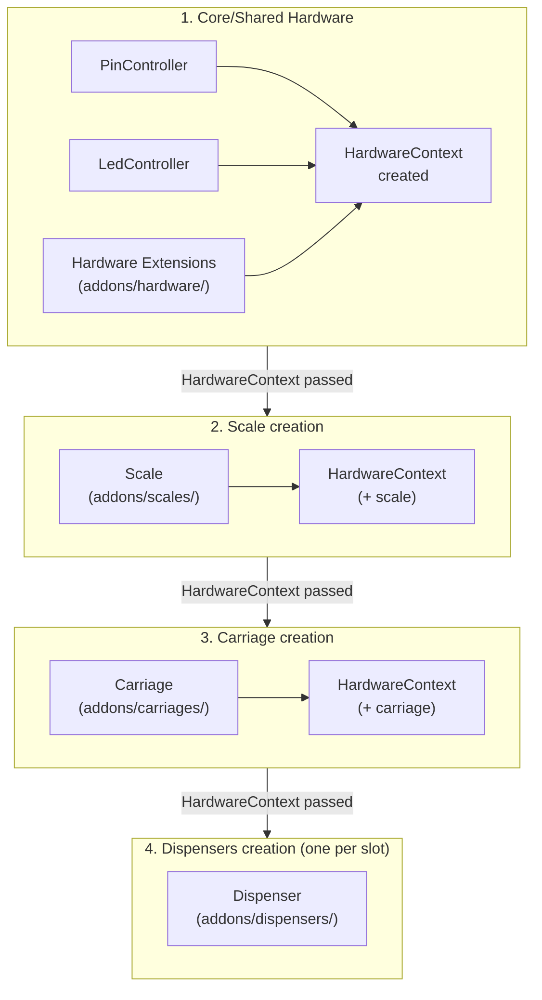

# Custom Hardware Extensions

CocktailBerry allows you to create your own implementations of hardware components.
This way you can integrate custom dispensers, scales, carriages or even other hardware components that are not natively supported.
Hardware extensions live in subfolders of the `addons` folder and are automatically discovered at startup.

!!! info "Only needed for unsupported hardware"
    In general, you only need to create custom hardware extensions if you have pumps, scales, or carriages that CocktailBerry does not support out of the box.
    If your hardware is already supported, you can configure it directly in the UI without any coding.

Supported types are:

- **Hardware context extensions** — shared hardware instances accessible to dispensers and other code via the `HardwareContext` (e.g. UART boards, SPI buses, custom controllers)
- **Dispensers** — control pumps and valves for dispensing liquids
- **Scales** — read weight measurements for weight-based recipes and estimation
- **Carriages** — control the movement of the pump carriage for multi-position setups

Best way to start is use the CLI commands to create skeleton files for your extensions, then fill in the implementation details.
See the sections below for detailed guides and examples for each type.

## Architecture Overview

The diagram below shows how the different extension types relate to each other and to the rest of the machine at startup and at runtime.



**Reading the diagram:**

The `HardwareContext` is built up in stages, so each component has access to everything created before it:

1. **Core hardware** — `PinController`, `LedController`, and hardware extension instances (`extra` dict) are created first.
2. **Scale** — receives the context, so it can access pins, LEDs, and hardware extensions if needed.
3. **Carriage** — receives the context including the scale, so it can access everything above.
4. **Dispensers** — each slot gets the fully assembled context.

## Extension Structure

Every hardware extension file — regardless of type — must export four things:

| Export            | Description                                                       |
| ----------------- | ----------------------------------------------------------------- |
| `EXTENSION_NAME`  | Unique name shown in the configuration dropdown (e.g. `"MyPump"`) |
| `ExtensionConfig` | Config class inheriting from the type-specific base config        |
| `CONFIG_FIELDS`   | Dict of **extra** config fields beyond the shared ones            |
| `Implementation`  | Hardware class inheriting from the type-specific base class       |

The concrete base classes for `ExtensionConfig` and `Implementation` depend on the hardware type.
See the type-specific sections below for details.

## Available Config Field Types

Use these types from `src.config.config_types` to define your custom fields:

| Type         | Description   | Example                                                      |
| ------------ | ------------- | ------------------------------------------------------------ |
| `IntType`    | Integer input | `IntType([build_number_limiter(0)], prefix="Pin:")`          |
| `FloatType`  | Float input   | `FloatType([build_number_limiter(0.1, 100)], suffix="ml/s")` |
| `StringType` | Text input    | `StringType(default="my_value")`                             |
| `BoolType`   | Checkbox      | `BoolType(check_name="Enable Feature")`                      |
| `ChooseType` | Dropdown      | `ChooseType(allowed=["A", "B"], default="A")`                |
| `ListType`   | List input    | `ListType(BoolType(), default=[])`                           |

Validators like `build_number_limiter(min, max)` from `src.config.validators` can be used to constrain values.
You always can write your own, for more information, see also the config section under addons.

## Hardware Context Extensions

Hardware context extensions let you register **shared hardware** — such as a UART board, SPI bus, or any custom controller — that multiple dispenser extensions (or other code) can access at runtime.

Unlike dispenser extensions, which create one instance *per pump slot*, a hardware context extension creates **one instance per extension** and stores it in `hardware.extra["YourExtensionName"]`.
Dispensers (and other extension code) then access it from the `HardwareContext` they receive.

This is the recommended approach when:

- Multiple pumps share a single communication bus (e.g. a UART board controlling N pumps)
- You need one-time initialization for hardware that several dispensers depend on
- You want GUI-configurable settings for that shared hardware (not hard-coded)

### Getting Started

!!! tip "Use the CLI"
    Create a skeleton file with the CLI command:

    ```bash
    uv run runme.py create-hardware "Your Hardware Name"
    ```

    This creates a ready-to-fill file in `addons/hardware/your_hardware_name.py`.

### Lifecycle

Hardware context extensions follow this lifecycle:

1. **Discovery & config registration** — Extensions are discovered and `CONFIG_FIELDS` are registered before config is read. The config key is `HW_<EXTENSION_NAME>` (uppercase, spaces replaced with underscores).
2. **Config load** — The GUI can now show and edit the hardware extension fields.
3. **`Implementation.create(config)`** — Called during `init_machine()`, before specific hardware (sub-)components are set up. The returned instance is stored in `hardware.extra["YourExtensionName"]`.
4. **Component set up** — Other components like dispensers receive the full `HardwareContext` (including `extra`). They access your hardware via `hardware.extra["YourExtensionName"]`.
5. **`Implementation.cleanup(instance)`** — Called at shutdown, before pins and other core hardware are released.

### Full Example

Below is a complete example of a hardware extension for a hypothetical UART pump board:

```python
from __future__ import annotations

from typing import Any

from src.config.config_types import ConfigClass, ConfigInterface, IntType, StringType # (1)!
from src.config.validators import build_number_limiter
from src.logger_handler import LoggerHandler
from src.programs.addons import BaseHardwareExtension # (2)!

EXTENSION_NAME = "UartBoard" # (3)!
_logger = LoggerHandler("UartBoard")


class ExtensionConfig(ConfigClass): # (4)!
    """Configuration for the UART pump board."""

    port: str
    baud_rate: int

    def __init__(
        self,
        port: str = "/dev/ttyUSB0",
        baud_rate: int = 9600,
        **kwargs: Any, # (5)!
    ) -> None:
        self.port = port
        self.baud_rate = baud_rate

    def to_config(self) -> dict[str, Any]: # (6)!
        return {"port": self.port, "baud_rate": self.baud_rate}

    @classmethod
    def from_config(cls, config: dict[str, Any]) -> ExtensionConfig: # (7)!
        return cls(**config)


CONFIG_FIELDS: dict[str, ConfigInterface] = { # (8)!
    "port": StringType(default="/dev/ttyUSB0"),
    "baud_rate": IntType([build_number_limiter(1200, 115200)]),
}


class UartConnection: # (9)!
    """Singleton-like UART connection managed by the framework."""

    def __init__(self, port: str, baud_rate: int) -> None:
        self.port = port
        self.baud_rate = baud_rate
        _logger.info(
            f"Connected to UART board on {port} @ {baud_rate}"
        )

    def send_command(self, pump_id: int, amount: float) -> None:
        """Send a dispense command to a specific pump."""
        # Your serial communication logic here
        pass

    def close(self) -> None:
        _logger.info("UART connection closed")


class Implementation(BaseHardwareExtension[ExtensionConfig]):  # (10)!
    """Manages the UART board lifecycle."""

    def create(self, config: ExtensionConfig) -> UartConnection:  # (11)!
        return UartConnection(config.port, config.baud_rate)

    def cleanup(self, instance: UartConnection) -> None:  # (12)!
        instance.close()
```

1. Import `ConfigClass` for your config and any field types you need. `ConfigInterface` is the type hint for the `CONFIG_FIELDS` dict values.
2. Import `BaseHardwareExtension` — the base class for all hardware context extensions.
3. Unique name used to identify this extension. The config key will be `HW_UARTBOARD`. Dispensers access the instance via `hardware.extra["UartBoard"]`.
4. Your config class must inherit from `ConfigClass`. Define all settings your hardware needs as attributes.
5. Always accept `**kwargs` to stay forward-compatible with future framework fields.
6. Serialize all fields to a dict — the framework calls this to persist your config.
7. Deserialize from a dict — the framework calls this to restore your config from the saved state.
8. Define your config fields here. These appear in the configuration UI so the user can adjust settings. Use validators like `build_number_limiter` to constrain values.
9. This is your actual hardware class — it can be any type you want. The framework stores the instance returned by `create()` in `hardware.extra["UartBoard"]` so dispensers can use it.
10. Your implementation must inherit from `BaseHardwareExtension`, parameterized with your `ExtensionConfig` type.
11. Called once during `init_machine()`. Create and return your hardware instance here. The return value can be any type — your dispenser extensions cast it accordingly.
12. Called at shutdown to release resources. Receives the same instance that `create()` returned.

### Using from a Dispenser Extension

A dispenser extension accesses the hardware context extension via `self.hardware.extra`:

```python
class Implementation(BaseDispenser):
    def __init__(self, slot, config, hardware):
        super().__init__(slot, config, hardware)
        self._board = hardware.extra["UartBoard"] # (1)!

    def _dispense_steps(self, amount_ml, pump_speed):
        self._board.send_command(self.slot, amount_ml) # (2)!
        # ... yield consumption updates ...
```

1. The key must match the `EXTENSION_NAME` of your hardware context extension. The framework guarantees that hardware extensions are created before dispensers, so the instance is always available here.
2. You can now call any method on the shared hardware instance. Since all dispensers receive the same `HardwareContext`, they all share the same `UartConnection` object.

For the full dispenser extension guide (including `hardware` access), see the [Dispensers](#dispensers) section below.

## Dispensers

Custom dispensers let you control any pump or valve hardware that CocktailBerry does not support out of the box.
Each dispenser extension is a single Python file placed in the `addons/dispensers/` folder.
Once added, the new dispenser type appears in the pump configuration dropdown alongside the built-in DC and Stepper types.

For dispensers, the base classes are:

- `ExtensionConfig` inherits from **`BasePumpConfig`** (`src.config.config_types`)
- `Implementation` inherits from **`BaseDispenser`** (`src.machine.dispensers.base`)

### Getting Started

!!! tip "Use the CLI"
    Create a skeleton file with the CLI command:

    ```bash
    uv run runme.py create-dispenser "Your Dispenser Name"
    ```

    This creates a ready-to-fill file in `addons/dispensers/your-dispenser-name.py`.

### Shared vs Custom Config Fields

Every dispenser automatically gets the following shared fields injected — you do **not** need to define them:

- `pump_type` — dropdown to select the dispenser type
- `volume_flow` — flow rate in ml/s
- `tube_volume` — tube volume in ml
- `consumption_estimation` — time or weight based
- `carriage_position` — position 0–100%

Only define your **extra** fields in `CONFIG_FIELDS`.
These will appear in the configuration UI between the pump type dropdown and the shared fields.
While you might not need all these shared fields for every dispenser, they are commonly used and provide a consistent configuration experience across dispenser types.

### ExtensionConfig

Your `ExtensionConfig` must inherit from `BasePumpConfig`.
Define any extra attributes your dispenser needs and make sure to call `super().__init__()` with the shared fields.
The `to_config()` method must serialize all fields (call `super().to_config()` and update with your extras).

!!! warning "Accept **kwargs"
    Your `__init__` should accept `**kwargs` to be forward-compatible with future shared fields.

### Implementation

Your `Implementation` class must inherit from `BaseDispenser` and implement these methods:

| Method                                   | Required | Description                                                                                                                                        |
| ---------------------------------------- | -------- | -------------------------------------------------------------------------------------------------------------------------------------------------- |
| `setup()`                                | **yes**  | Initialize hardware resources                                                                                                                      |
| `_dispense_steps(amount_ml, pump_speed)` | **yes**  | Generator that yields consumption values. Use `try/finally` for hardware cleanup. See details below.                                               |
| `stop()`                                 | no       | Emergency stop. Default sets the internal stop event. Override and call `super().stop()` if you need additional hardware cleanup (e.g. close pin). |
| `cleanup()`                              | no       | Release hardware resources at shutdown. Default does nothing.                                                                                      |

The constructor receives `slot` (pump position), `config` (your `ExtensionConfig` instance), `hardware` (`HardwareContext` — provides access to pin controller, scale, LED controller, carriage, and `extra` dict of hardware extension instances).

#### How `_dispense_steps()` Works

The base class provides a concrete `dispense()` method that drives your generator automatically:

1. Clears the stop event
2. Tares the scale (if connected)
3. Iterates your `_dispense_steps()` generator
4. Checks for cancellation between each yield
5. Calls progress callbacks on each yielded value

Your generator just needs to: activate hardware, yield consumption updates in a loop, and deactivate hardware in a `finally` block. The `finally` block runs on both normal completion and cancellation (the generator is automatically closed when the stop event fires).

### Inherited Attributes & Helpers

`BaseDispenser` provides several attributes and methods you can use in your implementation — no need to define them yourself:

| Attribute / Method                | Description                                                                                                                                                          |
| --------------------------------- | -------------------------------------------------------------------------------------------------------------------------------------------------------------------- |
| `self.slot`                       | Pump slot number (int), set from constructor                                                                                                                         |
| `self.config`                     | Your `ExtensionConfig` instance                                                                                                                                      |
| `self.volume_flow`                | Configured flow rate in ml/s (from config)                                                                                                                           |
| `self.carriage_position`          | Carriage position 0–100 (from config)                                                                                                                                |
| `self.hardware`                   | `HardwareContext` — access to `pin_controller`, `led_controller`, `scale`, `carriage`, and `extra` (see [Hardware Context Extensions](#hardware-context-extensions)) |
| `self._scale`                     | `ScaleInterface` or `None` — the connected scale, if any and dispensing is based on weight                                                                           |
| `self._get_consumption(estimate)` | Returns the scale reading in ml if a scale is present, otherwise returns the passed time/step-based `estimate`                                                       |
| `self.needs_exclusive`            | Property, `True` when a scale is attached. Used by the scheduler to run this dispenser exclusively (not in parallel with others)                                     |

#### Using the Scale

Scale taring is handled automatically by the base `dispense()` method. In your `_dispense_steps()` generator, just use `_get_consumption()` to transparently read either the scale or a time-based estimate:

```python
# In your _dispense_steps loop, use _get_consumption instead of a raw time estimate:
time_estimate = elapsed * effective_flow
consumption = self._get_consumption(time_estimate)
# If a scale is present, this returns the actual weight reading.
# Otherwise it returns your time_estimate as a fallback.
```

### Full Example

Below is a complete example of a simple dummy dispenser that simulates dispensing via sleep:

```python
from __future__ import annotations

import time
from collections.abc import Generator
from typing import TYPE_CHECKING, Any

from src import ConsumptionEstimationType
from src.config.config_types import BasePumpConfig, ConfigInterface, StringType # (1)!
from src.logger_handler import LoggerHandler
from src.machine.dispensers.base import BaseDispenser # (2)!
from src.machine.hardware import HardwareContext


EXTENSION_NAME = "Dummy" # (3)!
_logger = LoggerHandler("DummyDispenser")


class ExtensionConfig(BasePumpConfig): # (4)!
    """Dummy dispenser config with a custom label field."""

    label: str

    def __init__(
        self,
        label: str = "dummy",
        pump_type: str = EXTENSION_NAME,
        volume_flow: float = 30.0,
        tube_volume: int = 0,
        consumption_estimation: ConsumptionEstimationType = "time",
        carriage_position: int = 0,
        **kwargs: Any, # (5)!
    ) -> None:
        super().__init__(
            pump_type=pump_type,
            volume_flow=volume_flow,
            tube_volume=tube_volume,
            consumption_estimation=consumption_estimation,
            carriage_position=carriage_position,
        )
        self.label = label

    def to_config(self) -> dict[str, Any]: # (6)!
        config = super().to_config()
        config.update({"label": self.label})
        return config


CONFIG_FIELDS: dict[str, ConfigInterface] = { # (7)!
    "label": StringType(default="dummy"),
}


class Implementation(BaseDispenser): # (8)!
    """Dummy dispenser that simulates dispensing via sleep."""

    def __init__(
        self, slot: int, config: ExtensionConfig, hardware: HardwareContext,
    ) -> None:
        super().__init__(slot, config, hardware)
        self.label = config.label

    def setup(self) -> None: # (9)!
        _logger.info(f"Dummy dispenser '{self.label}' slot {self.slot} set up")

    def _dispense_steps( # (10)!
        self, amount_ml: float, pump_speed: int
    ) -> Generator[float, None, None]:
        effective_flow = self.volume_flow * pump_speed / 100
        step_interval = 0.1
        elapsed = 0.0

        _logger.info(
            f"Dummy '{self.label}' slot {self.slot}: "
            f"dispensing {amount_ml:.1f} ml"
        )
        consumption = 0.0
        try:
            # >>> Activate your hardware here <<<
            while True: # (11)!
                time.sleep(step_interval)
                elapsed += step_interval
                time_estimate  = elapsed * effective_flow, amount_ml
                consumption = self._get_consumption(time_estimate)
                yield consumption # (12)!
                if consumption >= amount_ml:
                    return
        finally:
            # >>> Deactivate your hardware here <<< (13)!
            _logger.info(
                f"Dummy '{self.label}' slot {self.slot}: "
                f"done, dispensed {consumption:.1f} ml"
            )

    def cleanup(self) -> None: # (14)!
        _logger.info(
            f"Dummy dispenser '{self.label}' slot {self.slot} cleaned up"
        )
```

1. Import `BasePumpConfig` for your config class and any config field types you need (here `StringType`).
2. Import `BaseDispenser` — the base class for all dispensers.
3. Unique name that appears in the pump type dropdown. Must match the `pump_type` default in your `ExtensionConfig`.
4. Your config class must inherit from `BasePumpConfig`. Add any extra attributes your dispenser needs.
5. Always accept `**kwargs` to stay forward-compatible with future shared fields.
6. Serialize all fields — call `super().to_config()` first, then update with your extra fields.
7. Only define your **extra** config fields here. Shared fields (`volume_flow`, `tube_volume`, etc.) and the `pump_type` dropdown are auto-injected.
8. Your dispenser implementation must inherit from `BaseDispenser`.
9. Called once to initialize hardware resources (e.g. GPIO pins, SPI buses).
10. Generator that yields consumption values. The base `dispense()` method handles stop events, scale taring, and progress callbacks — you just yield.
11. Use a simple `while True` loop. No need to check `self._stop_event` — the base class checks it between yields and closes the generator on cancellation.
12. Yield the current consumption. The base class passes this to the scheduler's progress callback. Important to do this regularly (e.g. every 0.1s) so the UI can update and cancellations are responsive.
13. The `finally` block runs on both normal completion and cancellation — use it for hardware cleanup (e.g. closing relay pins, stopping motors).
14. Called at program shutdown to release hardware resources.

## Scales

*TBD*

## Carriages

*TBD*
