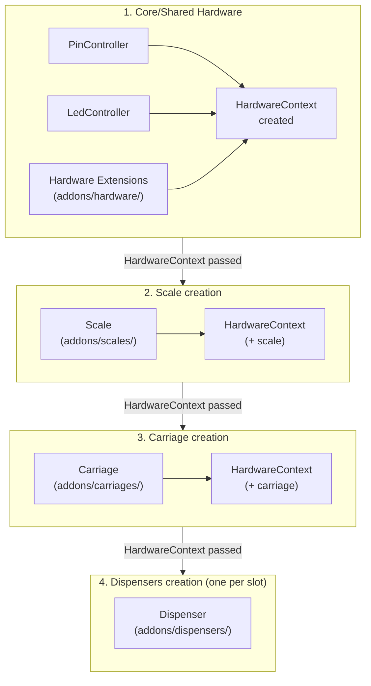

# Custom Hardware Extensions

CocktailBerry allows you to create your own implementations of hardware components.
This way you can integrate custom dispensers, scales, carriages or even other hardware components that are not natively supported.
Hardware extensions live in subfolders of the `addons` folder and are automatically discovered at startup.

!!! info "Only needed for unsupported hardware"
    In general, you only need to create custom hardware extensions if you have pumps, scales, or carriages that CocktailBerry does not support out of the box.
    If your hardware is already supported, you can configure it directly in the UI without any coding.

Supported types are:

- **[Hardware context extensions](hardware-context.md)** — shared hardware instances accessible to dispensers and other code via the `HardwareContext` (e.g. UART boards, SPI buses, custom controllers)
- **[Dispensers](dispensers.md)** — control pumps and valves for dispensing liquids
- **[Scales](scales.md)** — read weight measurements for weight-based recipes and estimation
- **[Carriages](carriages.md)** — control the movement of the pump carriage for multi-position setups

Best way to start is use the CLI commands to create skeleton files for your extensions, then fill in the implementation details.
See the subpages for detailed guides and examples for each type.

## Architecture Overview

The diagram below shows how the different extension types relate to each other and to the rest of the machine at startup and at runtime.

**Reading the diagram:**

The `HardwareContext` is built up in stages, so each component has access to everything created before it:

1. **Core hardware** — `PinController`, `LedController`, and hardware extension instances (`extra` dict) are created first.
2. **Scale** — receives the context, so it can access pins, LEDs, and hardware extensions if needed.
3. **Carriage** — receives the context including the scale, so it can access everything above.
4. **Dispensers** — each slot gets the fully assembled context.

## Extension Structure

Every hardware extension file — regardless of type — must export four things:

| Export            | Description                                                       |
| ----------------- | ----------------------------------------------------------------- |
| `EXTENSION_NAME`  | Unique name shown in the configuration dropdown (e.g. `"MyPump"`) |
| `ExtensionConfig` | Config class inheriting from the type-specific base config        |
| `CONFIG_FIELDS`   | Dict of **extra** config fields beyond the shared ones            |
| `Implementation`  | Hardware class inheriting from the type-specific base class       |

The concrete base classes for `ExtensionConfig` and `Implementation` depend on the hardware type.
See the type-specific sections below for details.

## Available Config Field Types

Use these types from `src.config.config_types` to define your custom fields:

| Type         | Description   | Example                                                      |
| ------------ | ------------- | ------------------------------------------------------------ |
| `IntType`    | Integer input | `IntType([build_number_limiter(0)], prefix="Pin:")`          |
| `FloatType`  | Float input   | `FloatType([build_number_limiter(0.1, 100)], suffix="ml/s")` |
| `StringType` | Text input    | `StringType(default="my_value")`                             |
| `BoolType`   | Checkbox      | `BoolType(check_name="Enable Feature")`                      |
| `ChooseType` | Dropdown      | `ChooseType(allowed=["A", "B"], default="A")`                |
| `ListType`   | List input    | `ListType(BoolType(), default=[])`                           |

Validators like `build_number_limiter(min, max)` from `src.config.validators` can be used to constrain values.
You always can write your own, for more information, see also the config section under addons.
