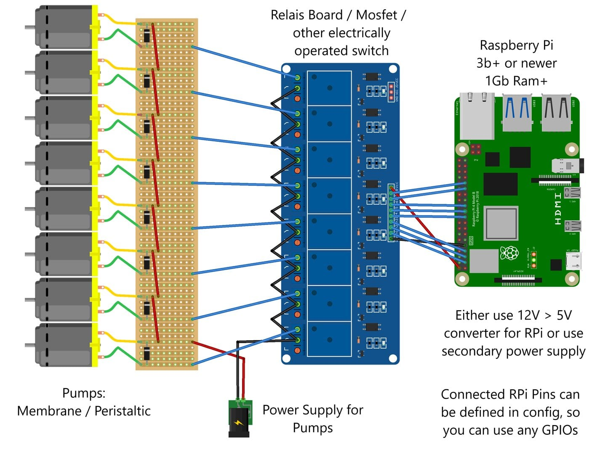

# Hardware

You can run the software on any non RPi hardware, but you won't be able to control the pins without a device supporting GPIO control.
To build a functional machine, you can take this reference and customize it to your needs.
This offers a good starting point what you might need.
How exactly you will build your CocktailBerry is completely up to you.

## Example Machine

The following components were used within the showcase for the Machines (CocktailBerry v1/v2/v3):

- 1x [Raspberry Pi 3b+](https://amzn.to/48bhCBc) (or newer [Model 4](https://amzn.to/4pqSH3v))
- 1x [5-inch Touch Screen](https://amzn.to/3K6Ntei) or [7-inch Touch Screen](https://amzn.to/49sKlnn) for the Raspberry Pi
- Official [Touch Screen](https://amzn.to/4pnDPmj) also works
- 1x Micro [SD-Card](https://amzn.to/3JY3Dqn) (16-32 Gb is enough, depending what else you want to store)
- 1x 5V Power supply for the [Raspberry Pi 3](https://amzn.to/3XbImwj) or [Raspberry Pi 4](https://amzn.to/48axtjp)
- 1-2x [8 Channel](https://amzn.to/49ya120) or [16 Channel](https://amzn.to/49xgxGe) Relay-Boards depending on pump count (important to have 5V input control)
- 6-24x Pumps, it should be food safe, examples are:
- [membrane pump](https://amzn.to/4ocmw6S) or [this one](https://amzn.to/4a6PfXl)
- [peristaltic pump](https://amzn.to/3LSyTrh)
- 1x [Power supply](https://amzn.to/49w0fgP) for the pumps
- 5-10m [Food safe hose/tubes](https://amzn.to/4ppufj3) for the pumps
- Female to Female [jumper wires](https://amzn.to/47TY7yc)
- Some wires, [Hex-Standoffs](https://amzn.to/4oRQBd0), Screws and other small parts for mounting
- Your custom build machine casing
- *Optional*: [HDMI](https://amzn.to/4ra7Wzo) and [USB](https://amzn.to/48n4NF7) cable for small space builds
- *Optional*: A good! [converter](https://amzn.to/4qT18oW) (using usb ones may result in too high voltage loss) if you only want one power source
- *Optional*: [USB C](https://amzn.to/3X9I7lw) or [Micro USB](https://amzn.to/4oQDCIu) open cable

## Payment Service

If you want to use the NFC-Reader functionality with the payment service, you will need at least two additional NFC-Reader and another Pi setup:

- 2x [USB RFID Reader](https://amzn.to/4p75hVZ), other ones might not work out of the box
- Compatible NFC tags (e.g., [MIFARE Classic](https://amzn.to/43ZPcsC) or [in Blue](https://amzn.to/43ZPcsC))
- 1x [Raspberry Pi 3b+](https://amzn.to/48bhCBc) (or newer [Model 4](https://amzn.to/4pqSH3v))
- Additional monitor + mouse + keyboard or another touchscreen see above

## Teams Dashboard

The following components were used within the showcase for the Teams Dashboard:

- 1x [Raspberry Pi 3b+](https://amzn.to/48bhCBc) (or newer [Model 4](https://amzn.to/4pqSH3v), [Model 5](https://amzn.to/4i9h2IG))
- 1x [7-inch Touch Screen](https://amzn.to/47SVAnN)
- 1x [Display Casing](https://amzn.to/49sLPOt)
- 1x Micro [SD-Card](https://amzn.to/3JY3Dqn)
- 1x 5V Power supply for the [Raspberry Pi 3](https://amzn.to/3XbImwj), [Pi 4](https://amzn.to/48axtjp) or [Pi 5](https://amzn.to/4885zEN)

## Possible Basic Circuit

The following picture shows a possible circuit for CocktailBerry.
The Raspberry Pi will provide too litte power / current to operate the pumps.
You have to use two power circuits, one for powering the Raspberry Pi and one for the pumps.
The pump circuit will be most likely 12 or 24 V.
You can either use two different power supplies or use a step down converter for the RPi.
The RPi will control a relay, mosfet or another electrical switch over the GPIO output.

<figure markdown>
  
  <figcaption>Possible Circuit Schema</figcaption>
</figure>

You can use any of the GPIOs of the RPi, the connected pump to that pin can be defined in the config.
The switch will then turn the pump on or of over the RPi.
How you will build your CocktailBerry is still completely up to you.
The only restriction by the software is that the GPIO pins are turned on / off over the RPi.

## Custom PCBs or STLs

!!! warning "Help Wanted"
    We are currently working on a custom PCB for even easier connection and cable management.
    If you are interested in helping [reach out to us](mailto:cocktailmakeraw@gmail.com).
    With your help, we can make this project even better.

When the PCB is in an acceptable state, there will also be a new design fitting for that PCB.
In the future we are planning to provide the files here or a link to their origin.
