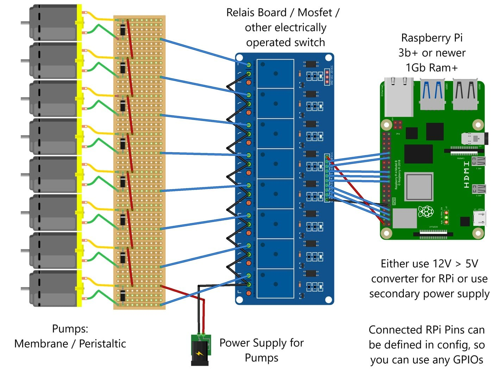

# Hardware

You can run the software on any non RPi hardware, but you won't be able to control the pins without a device supporting GPIO control.
To build a functional machine, you can take this reference and customize it to your needs.
This offers a good starting point for what you might need.
How exactly you will build your CocktailBerry is completely up to you.

!!! tip "Official boards and machines"
    Don't want to design your own? The official [hardware project](https://hardware.cocktailberry.org/)
    has ready-to-order control boards and fully 3D-printable machines with assembly guides.

## Example Machine

The following components were used within the showcase for the Machines (CocktailBerry MK series and 2-Go):

- 1x {{ extra.pi_3bplus_link }} (or newer {{ extra.pi_4_link }}, {{ extra.pi_5_link }}); for the [v2 web interface](web.md) use at least a Pi 4 with 2 GB RAM
- 1x {{ extra.touch_5in_link }} or {{ extra.touch_7in_link }} for the Raspberry Pi
- {{ extra.touch_official_link }} also works
- 1x {{ extra.sd_card_link }} (depending on what else you want to store)
- 1x {{ extra.pi3_power_supply_link }} or {{ extra.pi4_power_supply_link }}
- 1-2x {{ extra.relay_board_link }} or other RPi (needs 3.3V Logic Level, 5V will NOT WORK!!!) Relay-Boards depending on pump count (important to have 5V input control)
- *Alternative*: {{ extra.motor_shield_azdelivery_link }} or {{ extra.motor_shield_adafruit_link }} 4 DC or 2 Stepper Motors per shield, has reversion built in
- 6-24x Pumps, they should be food safe, examples are:
- {{ extra.membrane_pump_link }} or {{ extra.membrane_pump_alt_link }}
- {{ extra.peristaltic_pump_link }}
- 1x {{ extra.power_supply_12v_link }} for the pumps
- 5-10m {{ extra.tubing_link }} for the pumps
- {{ extra.jumper_wires_link }}
- Some wires, {{ extra.hex_standoffs_link }}, Screws and other small parts for mounting
- Your custom build machine casing
- *Optional*: {{ extra.hdmi_cable_link }} and {{ extra.usb_cable_link }} for small space builds
- *Optional*: A good {{ extra.voltage_converter_link }} (using USB ones may result in too high voltage loss) if you only want one power source
- *Optional*: {{ extra.usb_c_open_cable_link }} or {{ extra.micro_usb_open_cable_link }}

## Payment Service

If you want to use the NFC-Reader functionality with the payment service, you will need at least two additional NFC readers and another Pi setup:

- 2x {{ extra.rfid_reader_link }} — most generic USB readers work, this one is tested
- Compatible {{ extra.nfc_tags_link }}
- 1x {{ extra.pi_3bplus_link }} (or newer {{ extra.pi_4_link }})
- Additional monitor + mouse + keyboard or another touchscreen; see above

## Teams Dashboard

The following components were used within the showcase for the Teams Dashboard:

- 1x {{ extra.pi_3bplus_link }} (or newer {{ extra.pi_4_link }}, {{ extra.pi_5_link }})
- 1x {{ extra.touch_7in_teams_link }}
- 1x {{ extra.display_casing_link }}
- 1x {{ extra.sd_card_link }}
- 1x {{ extra.pi3_power_supply_link }}, {{ extra.pi4_power_supply_link }} or {{ extra.pi5_power_supply_link }}

## Possible Basic Circuit

The following picture shows a possible circuit for CocktailBerry.
The Raspberry Pi will provide too little power / current to operate the pumps.
You have to use two power circuits, one for powering the Raspberry Pi and one for the pumps.
The pump circuit will most likely be 12 or 24 V.
You can either use two different power supplies or use a step down converter for the RPi.
The RPi will control a relay, MOSFET or another electrical switch via the GPIO output.

<figure markdown>
  
  <figcaption>Possible Circuit Schema</figcaption>
</figure>

You can use any of the GPIOs of the RPi, the connected pump to that pin can be defined in the config.
The switch will then turn the pump on or off via the RPi.
How you will build your CocktailBerry is still completely up to you.
The only restriction by the software is that the GPIO pins are turned on / off via the RPi.

## Official PCBs and Machines

The official [hardware project](https://hardware.cocktailberry.org/) provides custom control boards (PCBAs) that replace the relay arrays and jumper wiring described above, plus fully 3D-printable machines with parts lists and assembly guides.
Fabrication files are ready to order (e.g. at JLCPCB), and the sources live in the [hardware repository](https://github.com/AndreWohnsland/CocktailBerry-Hardware) - contributions are welcome.

*[5V will NOT WORK]: The relay board input control must use 3.3V logic level (RPi GPIO output), look that they are compatible with the RPi. Also, 16 Relay boards are known to cause issues, so try to avoid them.
