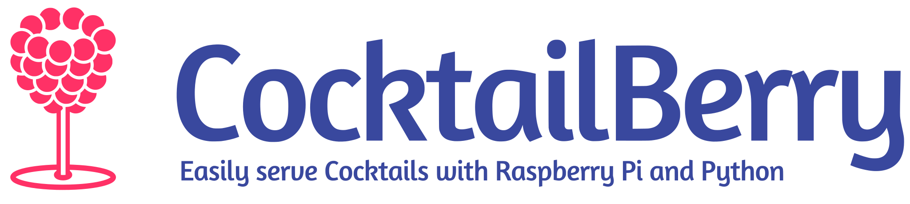

Welcome to the CocktailBerry documentation.
CocktailBerry is a Python and Qt (or React for v2) based software for a cocktail machine on the Raspberry Pi.
It enables you to build your own, fully customized machine, while still be able to use the identical software on each machine.
Here you will find everything to get started!

<a href="https://demo.cocktailberry.org/" class="cta-btn primary-btn"> v2 Demo </a>
  <a href="https://cocktailberry.org/" class="cta-btn secondary-btn"> Homepage </a>
  <a href="quickstart/" class="cta-btn primary-btn"> Quickstart </a>
  <a href="setup/" class="cta-btn secondary-btn"> Set Up </a>

Supercharge your next party to a whole new level! 🐍 + 🍸 = 🥳

Like this project? Give it a star on [GitHub](https://github.com/AndreWohnsland/CocktailBerry)! ⭐

## Features

CocktailBerry currently comes in two versions, v1 and v2.
The v1 is the stable version which ships the QT app as a single application.
[v2](https://docs.cocktailberry.org/web/) is the new version with a separate API and UI, which offers more flexibility, but might have some issues on build in touchscreens.
Both versions have the full feature set listed below.

CocktailBerry offers the following features:

- Prepare cocktails of a given volume and adjusted concentration of alcoholic ingredients
- Let customers pay over NFC chips/cards
- Add new ingredients and recipes with needed information over the UI
- Specify additional ingredients for later hand add within a recipe (like sticky syrup)
- Define connected ingredients to the machine and existing additional ingredients over the UI
- Auto calculate and display possible recipes dependent on given information
- Option to serve cocktails without alcohol
- Execute a cleaning program to get rid of remaining fluids
- Visualize the cocktail data and get insights
- Run headless, so you can access it over another device
- Send cocktail production data to a given endpoint, for example a webhook
- Keep track of cocktail count and volume from different teams for some fun competition
- Select different themes to fit your liking
- Switch between user interface languages
- Support WS281x LEDs on your machine
- Support for RFID/NFC reader
- Implement your own [addon](https://github.com/AndreWohnsland/CocktailBerry-Addons) to extend the base functionality

In addition, there is the possibility to use and set up a second device as a dashboard:

- Provide the teams API to post and get cocktail data
- Display different modes of data for a by team comparison
- _Optional_: Use the dashboard as WiFi hot-spot
