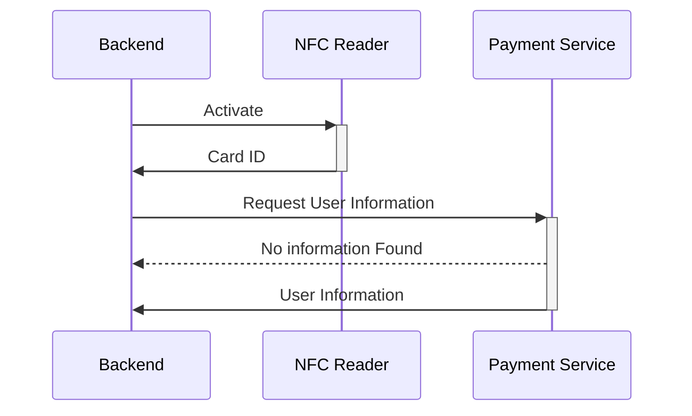
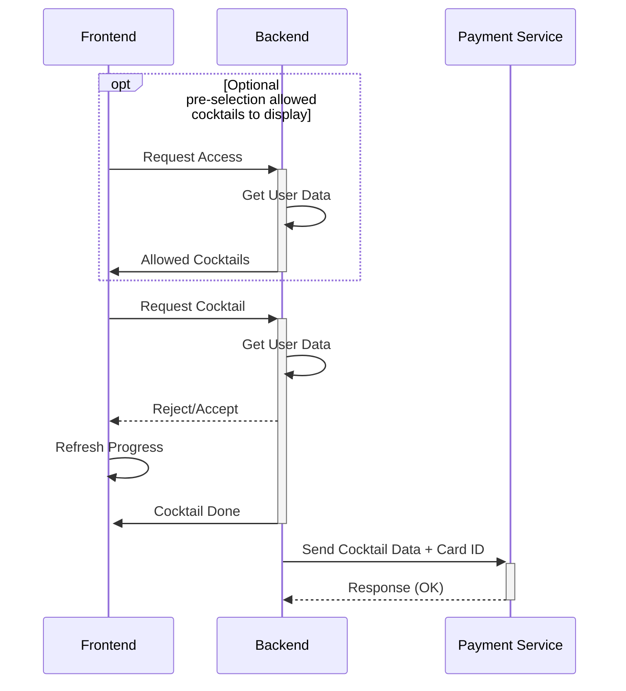

# Setting Up and Using NFC

This section provides instructions on how to set up and use Near Field Communication (NFC) on your device.
This is an optional feature, where you can use CocktailBerry in a more robust way to limit cocktail spending by some criteria.

## Prerequisites

To use NFC with CocktailBerry, you will need the following:

- NFC reader compatible with the list of supported readers
- Compatible NFC tags (e.g., TBD)
- The CocktailBerry Manager Service (NAME TBD) running in the same network as your CocktailBerry device
- CocktailBerry version 2.10 or higher

## Concept

If this feature is enabled, user will need to scan an NFC tag before being able to order a cocktail.
The tag will be read by the NFC reader, and the unique identifier (UID) of the tag will be sent to the CocktailBerry Manager Service.
The Manager Service will then check if the UID is valid and if the user associated with the tag has sufficient balance to order a cocktail.
A Tag ID can be associated with a 18+ or younger than 18 user, allowing to restrict cocktail orders based on age.
If the UID is valid and the user has sufficient balance, the order will be processed.
The Service will take care of deducting the cocktail price from the user's balance.
Also, managing user balances and age restrictions will be handled by the Manager Service.

Basic NFC flow to get user information:

This flow is then used when ordering a cocktail:

While it can be optional to scan a tag to view allowed cocktails, scanning a tag is mandatory to order a cocktail.
This pre-selection of allowed cocktails can be used to hide alcoholic cocktails for underage users or similar cases.

## Configuration

You can manage the settings like all other settings over the CocktailBerry Interface.
See also the [Configuration documentation](configuration.md) for more details.
