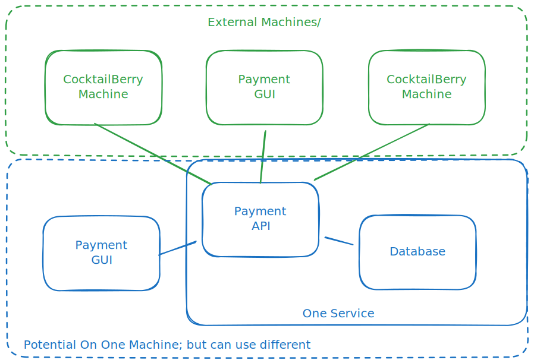

# Setting Up and Using the Payment Feature

!!! info "First Of All"
    Take note that none of this section is required to run the base program.
    This is a way to run your CocktailBerry machines in a more commercial mode.
    If you are not interested in them, just skip this section.

## Overview

If you want to use CocktailBerry autonomously, while still charging for cocktails, you can use one of the Payment Features.
This is an optional feature, where you can use CocktailBerry in a more robust way to limit cocktail spending by some criteria.
Currently, two types are supported: NFC based payments and SumUp Terminal payments.

=== "NFC Based"

    For the NFC based payments, a separate Payment Service is used to manage user entities and their balances.
    You can own the whole service and manage the NFC tags yourself.
    A "User" entity is a NFC tag, which can have some (non-personal) properties associated with it.
    Currently supported criteria are:

    - **Alcohol restriction**: Users can be restricted from ordering alcoholic cocktails (child vs adult).
    - **Balance**: Each entity can have a balance, which is checked and deducted when ordering cocktails.

    A separate payment service needs to be installed and setup to manage the user entities.
    There is a dedicated project and (see below) setup instructions for this service.

=== "SumUp"

    !!! bug "Still in Beta"
        The SumUp payment integration is still in beta.
        It should work fine, but might be rough around the edges.

    For SumUp Terminal payments, a physical SumUp card terminal (Solo) is used to process payments.
    CocktailBerry as well as the terminal need to be connected to the internet for this to work.
    When a user wants to order a cocktail, CocktailBerry will request a payment from the SumUp Terminal.
    This will be done over the SumUp Cloud API, which is currently only supported for SumUp Solo terminals.
    The user will then need to confirm the payment on the terminal, by the supported payment methods.
    You will need a SumUp account and a compatible terminal for this to work.

## Prerequisites

To use payments with CocktailBerry, you will need the following:

=== "NFC Based"
    - NFC reader compatible with the list of supported readers, [ACR1252U](https://amzn.to/4irVt6h) is recommended
    - Compatible NFC tags (e.g., [MIFARE Classic](https://amzn.to/43ZPcsC) or [in Blue](https://amzn.to/43ZPcsC))
    - The [CocktailBerry Payment](https://github.com/AndreWohnsland/CocktailBerry-Payment) Service reachable over network by your CocktailBerry device
    - CocktailBerry version 3.0 or higher

=== "SumUp"
    - A [SumUp Solo Terminal](https://store.sumup.com/de-DE/website/product-selection/card_reader.solo_bundle_cradle)
    - A [SumUp Account](https://www.sumup.com/) fully set up and you merchant code
    - API key generated for your account
    - CocktailBerry version 3.1 or higher

!!! danger "Updating from older Versions?"
    If you are updating from an older version of CocktailBerry, you might need to run some additional setup steps.
    It is recommended to backup your current settings and do a clean install over the setup script instead.
    Then use the backup to restore your settings.

If you want to update your existing installation, do the usual update process.
If CocktailBerry cannot start after the update run:

```bash
cd ~/CocktailBerry
bash scripts/setup_usb_nfc.sh
```

After that, CocktailBerry should start normally again.

## Concept

If this feature is enabled, user will need to pay before being able to order a cocktail.

=== "NFC Based"
    When using NFC based payments, each user will need to have an NFC tag (e.g., card or key fob) associated with them.
    The tag will be read by the NFC reader, and the unique identifier (UID) of the tag will be sent to the CocktailBerry Manager Service.
    The Manager Service will then check if the UID is valid and if the user associated with the tag has sufficient balance to order a cocktail.
    A Tag ID can be associated with a 18+ or younger than 18 user, allowing to restrict cocktail orders based on age.
    If the UID is valid and the user has sufficient balance, the order will be processed.
    The Service will take care of deducting the cocktail price from the user's balance.
    Also, managing user balances and age restrictions will be handled by the Manager Service.

=== "SumUp"
    When using SumUp Terminal payments, the CocktailBerry machine will communicate with the SumUp Terminal to process payments.
    When a user wants to order a cocktail, the CocktailBerry machine will send a payment request to the SumUp Terminal.
    The user will then need to confirm the payment on the terminal using their preferred payment method (e.g., card, mobile payment).
    Once the payment is confirmed, the CocktailBerry machine will process the order and dispense the cocktail.

Overall Process:

=== "NFC Based"
    ```mermaid
    sequenceDiagram
        actor c as Customer
        participant cb as CocktailBerry
        participant p as Payment Service
        actor s as Service Worker
        s-->>p: Initializes NFC chip
        c->>+s: Purchase Card/Balance
        s-->>p: Add Balance
        s->>-c: Supplies NFC Chip
        c->>+cb: Order with NFC
        cb->>+p: Request Info
        p->>-cb: Balance, Info
        cb->>c: Spend Cocktail
        cb->>-p: Subtract Balance
    ```

    The service worker initializes the NFC chip and adds balance when the customer purchases a card.
    When the customer orders a cocktail using NFC, CocktailBerry requests user information from the Payment Service.
    The Payment Service responds with the user's balance and other relevant information.
    CocktailBerry processes the order and deducts the cocktail price from the user's balance.

    While it can be optional to scan a tag to view allowed cocktails, scanning a tag is mandatory to order a cocktail.
    This pre-selection of allowed cocktails can be used to hide alcoholic cocktails for underage users or similar cases.

    <figure markdown>
    
    <figcaption>High-level schema of how the service integrates with CocktailBerry</figcaption>
    </figure>

    The service consists of two main components:

    1. **Backend API**:
    A RESTful API built with FastAPI, responsible for handling all payment-related operations, user management, and database interactions.
    Only one instance of this should be used to have consistent data.
    1. **Frontend GUI**:
    Management Admin application for owners to create and top up nfc chips/cards.
    You can use as many instances as you want.
    While you can run it on the same device as the backend, it is recommended to run it on a separate device for better performance and security.

    CocktailBerry Machines using the payment option will communicate with the backend API to process payments and manage user balances.
    This requires the machines being either on the same network or having access to the backend API over the internet.
    User will then pay the cocktails over NFC cards, while service personal can manage the users and top up balances via the GUI separately.

=== "SumUp"
    ```mermaid
    sequenceDiagram
        actor c as Customer
        participant t as SumUp Terminal
        participant cb as CocktailBerry
        participant p as SumUp API
        c->>cb: Order Cocktail
        cb->>+p: Request Payment
        p->>t: Start Payment
        c->>t: Pay Over Terminal
        t->>p: Sends Transaction Data
        p->>-cb: Receives Data
        cb->>c: Spend Cocktail
    ```

    The customer orders a cocktail from the CocktailBerry machine.
    CocktailBerry requests a payment from the SumUp API.
    The SumUp API communicates with the SumUp Terminal to start the payment process.
    The customer pays using the terminal over Card or other supported methods.
    The transaction data is sent back to the SumUp API, which then is polled by CocktailBerry about the successful payment.
    Since this is done over the cloud API, CocktailBerry and the Terminal both need to be connected to the internet.
    Once the payment is confirmed, CocktailBerry processes the order and dispenses the cocktail.

## Setup

If you have experienced CocktailBerry, you know that we try to simplify the setup as much as possible.
We boiled the process down to a few commands, it will still be a little bit more complex than a regular CocktailBerry setup.

The recommended way for a "basic" hardware setup is:

=== "NFC Based"
    - A Server (Raspberry Pi 4 or similar) running the payment API over docker
    - A desktop device + USB NFC reader running the payment GUI, can be Windows
    - CocktailBerry machine + USB NFC reader, connected to the payment API over the network

    While you can run the backend on the same machine as CocktailBerry, or the the Admin payment GUI, it is recommended to run them on separate devices for better performance and security.

    If you want to really keep it minimalistic, you can also run both API and GUI on the same device, e.g. a Raspberry Pi 4.
    In this case you would need to ensure that this device is not down or turned off.
    Otherwise users will not be able to order cocktails.
    More CocktailBerry machines or GUI instances can be added at any time, just point them to the same backend API.

    CocktailBerry machines should be set up according to the official documentation, just ensure that the payment option is enabled and the API URL is set correctly.
    For your other devices, follow the steps below, we need to distinguish between Windows and Linux based systems.
    MacOS might work as well, but is not officially supported.

=== "SumUp"
    - A CocktailBerry machine + [SumUp Solo Terminal](https://store.sumup.com/de-DE/website/product-selection/card_reader.solo_bundle_cradle)

    You will need a setup [sumup](https://www.sumup.com/) account for this to work.
    Once created, you will be asked multiple things during the account setup.
    When you are done, see at your account settings, where you should see your Merchant Code (a string starting with "MCM").
    In addition, you will need to [create an API key](https://me.sumup.com/settings/api-keys) for your account.
    More information can also be found in the [SumUp Developer Documentation](https://developer.sumup.com/tools/authorization/authorization#create-api-key).
    Keep this safe, you will need it in the CocktailBerry settings.

    For more information, you can also see the [official SumUp FAQ](https://developer.sumup.com/help).
    

### Installation Steps

=== "NFC Based"

    Follow the according steps for your OS to set up the payment service and GUI.

    === "Linux Systems"

        Linux is the most easy way, since most of the things can be done over a script.
        Just run:

        ```bash
        wget -O - https://raw.githubusercontent.com/AndreWohnsland/CocktailBerry-Payment/main/scripts/unix_installer.sh | bash
        ```

    === "Windows Systems"

        Windows can be quite restrictive when it comes to executing scripts and similar tasks.
        Make sure the user is able to execute PowerShell as well as Python scripts and can install applications.
        If you want to use docker on windows, make sure you [install it](https://docs.docker.com/desktop/setup/install/windows-install/) and set it to auto start with windows.

        Then open a PowerShell terminal as Administrator and run the following command to download and execute the installation script:

        ```powershell
        powershell -ExecutionPolicy ByPass -c "irm https://github.com/AndreWohnsland/CocktailBerry-Payment/blob/main/scripts/windows_installer.ps1 | iex"
        ```

        <!-- TODO: LINK -->
        <!-- Alternatively, there is also a pre-built executable available for the GUI, which you can download from the release page. -->
        <!-- You might not be able to set all options tough when using this directly, so even when using this, going over this preparation and service installation steps is recommended. -->

        If [uv](https://docs.astral.sh/uv/getting-started/installation) or [git](https://git-scm.com/install/windows) fails to install, you might need to install them manually first.

    **Service installation**

    Make sure you have followed the preparation steps for your OS.
    After that you should already be in the CocktailBerry-Payment folder.
    You can use:

    ```bash
    uv run -m cocktailberry.setup
    ```

    to start the interactive setup.
    You will be prompted for all necessary information and the script will set up everything for you.
    You might need to restart your device after the installation is done, depending on the options you selected and your OS.

=== "SumUp"
    First, you will need to provide both, the SumUp API key as well as the merchant code to CocktailBerry.
    You can enter both over the GUI, or edit the `custom_config.yaml` directly in the CocktailBerry folder, since the copying the key is better.
    Look for the `PAYMENT_SUMUP_API_KEY` and `PAYMENT_SUMUP_MERCHANT_CODE` entries and set them accordingly.
    In addition, you will need to select the SumUp payment option in the GUI or set `PAYMENT_OPTION` to `SumUp` in the config file.

    After that, you will need to connect your terminal to the internet following the steps on it.
    Then select Cloud API mode on the terminal.
    It will display a code, you will need this in CocktailBerry to link the terminal to your account.
    Go to options -> SumUp, there you can give you Terminal a name and enter the code.
    After submitting, you should see a successful message and the terminal should be displayed and selected in the list of connected Terminals.
    In case you own multiple machines and registered terminals, you can also select or change the terminal over the dropdown.
    Take note that only one terminal per machine is supported.
    The terminal identifier will be stored in the config file as `PAYMENT_SUMUP_TERMINAL_ID`.

    Since you will store the API key in you settings, which is accessible over the options GUI, make sure to set a good master password to protect your settings.

## Configuration

You can manage the settings like all other settings over the CocktailBerry Interface.
See also the [Configuration documentation](setup.md) for more details.

In general, the options were made so you can tweak them as you needed.
You might experiment with different settings to find the best fit for your use case.

Some important options are:

=== "NFC Based"
    - **Opt In**: Enable and select the payment service integration.
    - **Auto Logout**: Automatically log out users after a specified time, only enable this if you are sure this time is more than enough for a user to order a cocktail.
    - **Logout after Order**: Log out the user after each order, useful if users usually just order one Cocktail and you use the lock screen.
    - **Lock Screen**: User needs to scan his NFC to unlock the cocktail selection. Use this if you want to enforce first time scanning to filter/show only possible cocktails.
    - **Show not possible cocktails**: Show all cocktails (not possible in another style), even if the user is not allowed to order them. Might be not the best if you use age restrictions, since they will never be able to order them.

=== "SumUp"
    - **Opt In**: Enable and select the SumUp payment integration.
    - **Account Info**: API key, Merchant code and Terminal ID.
