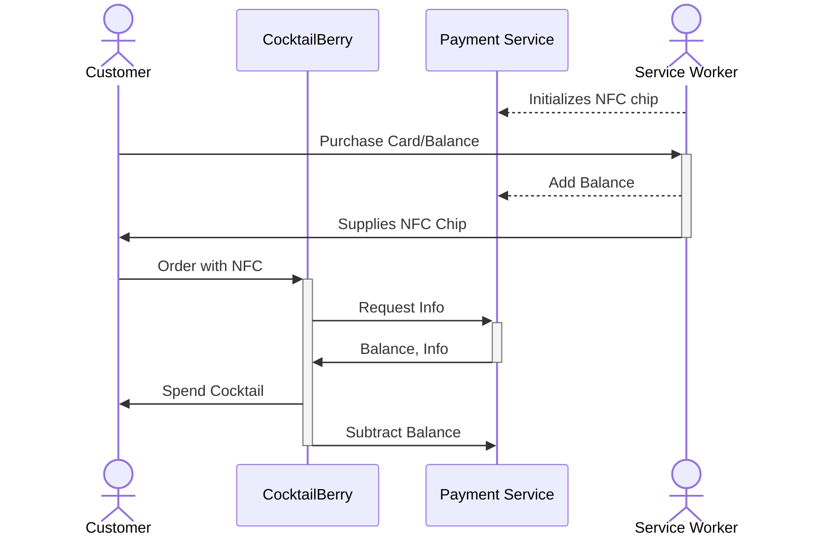
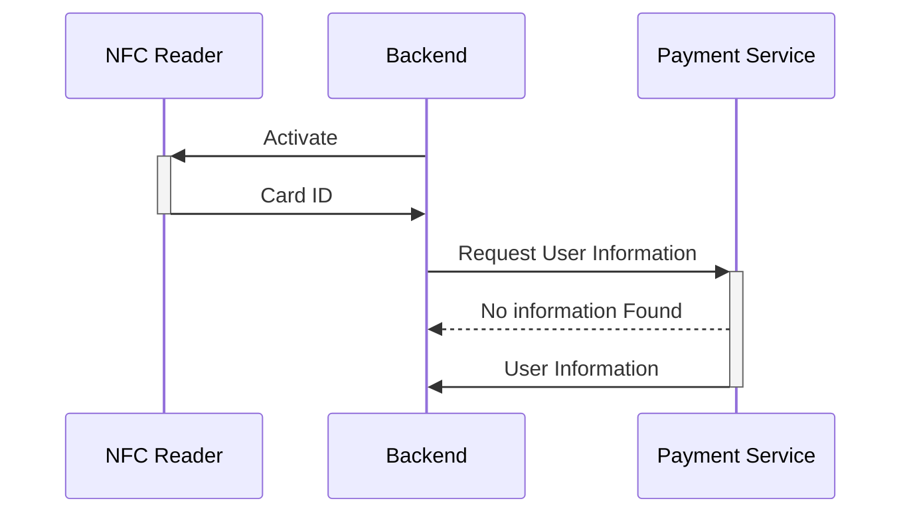

# Setting Up and Using the Payment Service with NFC

!!! info "First Of All"
    Take note that none of this section is required to run the base program.
    These are just some fun additions, which you can optionally use.
    If you are not interested in them, just skip this section.

If you want to use CocktailBerry autonomously, while still charging for cocktails, you can use the NFC Payment Service.
This is an optional feature, where you can use CocktailBerry in a more robust way to limit cocktail spending by some criteria.
A "User" entity is a NFC tag, which can have some (non-personal) properties associated with it.
Currently supported criteria are:

- Alcohol restriction: Users can be restricted from ordering alcoholic cocktails.
- Balance: Each entity can have a balance, which is checked and deducted when ordering cocktails.

## Prerequisites

To use NFC with CocktailBerry, you will need the following:

- NFC reader compatible with the list of supported readers, [ACR1252U](https://amzn.to/4irVt6h) is recommended
- Compatible NFC tags (e.g., [MIFARE Classic](https://amzn.to/43ZPcsC) or [in Blue](https://amzn.to/43ZPcsC))
- The CocktailBerry Payment Manager Service running in the same network as your CocktailBerry device
- CocktailBerry version 2.10 or higher

## Concept

If this feature is enabled, user will need to scan an NFC tag before being able to order a cocktail.
The tag will be read by the NFC reader, and the unique identifier (UID) of the tag will be sent to the CocktailBerry Manager Service.
The Manager Service will then check if the UID is valid and if the user associated with the tag has sufficient balance to order a cocktail.
A Tag ID can be associated with a 18+ or younger than 18 user, allowing to restrict cocktail orders based on age.
If the UID is valid and the user has sufficient balance, the order will be processed.
The Service will take care of deducting the cocktail price from the user's balance.
Also, managing user balances and age restrictions will be handled by the Manager Service.

Overall Process:

The service worker initializes the NFC chip and adds balance when the customer purchases a card.
When the customer orders a cocktail using NFC, CocktailBerry requests user information from the Payment Service.
The Payment Service responds with the user's balance and other relevant information.
CocktailBerry processes the order and deducts the cocktail price from the user's balance.

Basic NFC flow to get user information:

The NFC reader is activated by the backend, which then reads the Card ID from the NFC tag.
The backend requests user information from the Payment Service using the Card ID.
The information is returned to the backend, which will be used for further processes.

While it can be optional to scan a tag to view allowed cocktails, scanning a tag is mandatory to order a cocktail.
This pre-selection of allowed cocktails can be used to hide alcoholic cocktails for underage users or similar cases.

## Configuration

You can manage the settings like all other settings over the CocktailBerry Interface.
See also the [Configuration documentation](setup.md) for more details.
