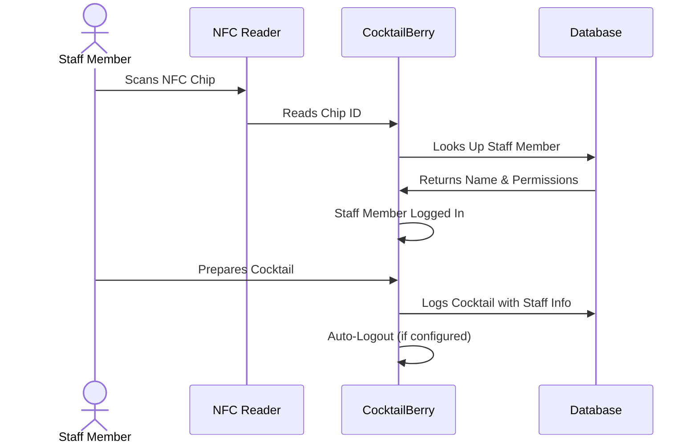

# Service Personnel Mode

!!! info "Optional Feature"
    Service Personnel Mode is an optional feature for operators who want to track which staff member prepared each cocktail and control access to the machine.
    If you don't need staff tracking or per-person access control, you can skip this section.

!!! warning "NFC Reader Conflict"
    Service Personnel Mode and CocktailBerry NFC Payment both require the NFC reader.
    They cannot be enabled at the same time, nor is the initial intend that they would be used together.
    If you need payment functionality, see the [Payment Feature](payment.md) instead.

## Overview

Service Personnel Mode lets you manage who is using your CocktailBerry machine.
Each staff member gets an NFC chip that they scan to log in before they can prepare cocktails.
This gives you two main benefits:

- **Accountability**: Every cocktail is logged with the name of the person who made it, giving you full visibility over your operation.
- **Access Control**: Authorized staff can bypass the maker password for different specified tabs. So you do not need to share the password, but still control who can access what.

## Enabling Service Personnel Mode

To enable the feature, activate `WAITER_MODE` in the configuration, you can find it under the software section.
You will need an NFC reader connected to your machine (same hardware as for the [payment](payment.md) feature).
On startup, CocktailBerry validates that the NFC reader is available and disables the mode gracefully if it is not.

??? info "Configuration Options"

    | Setting                        | Description                                          |
    | ------------------------------ | ---------------------------------------------------- |
    | `WAITER_MODE`                  | Enable or disable Service Personnel Mode             |
    | `WAITER_LOGOUT_AFTER_COCKTAIL` | Log out after cocktail preparation                   |
    | `WAITER_AUTO_LOGOUT_S`         | Log out after x seconds of inactivity (0 = disabled) |

## Registering Staff

Before your staff can use the machine, you need to register their NFC chips.
Open the Service Personnel management window from the options menu.
When a staff member scans their NFC chip, the scanned ID appears in the management view.
You can then assign a name and select which permissions that person should have (Maker, Ingredients, Recipes, Bottles).
Each permission controls whether the person can access that tab, and whether they can bypass the maker password for it.

## Login and Logout Flow

The typical workflow looks like this:

Once logged in, the staff member can then prepare cocktails, and each preparation is logged to their name.
Logout happens either manually, automatically after a cocktail, or after a configured timeout.

### Difference in Appearance Between v1 and v2

Since we use distinct GUI technologies for v1 (Qt) and v2 (Web), there are some differences in how the logged-in staff member is displayed and how logout works.
See the according section for your version below.

=== "v1"

    On the maker view, there is no dedicated staff indicator or logout button.
    Logout happens through the configured auto-logout settings or by scanning a different chip.

=== "v2"

    The currently logged-in staff member is displayed as an inline badge on the maker screen, showing their name.
    Clicking the badge reveals a dedicated logout button, allowing the staff member to log out directly.

### Password Bypass

If a staff member has the appropriate permissions, they can bypass the maker password for the tabs they have access to.
See some specifics on implementation and differences between v1 and v2 below.

=== "v1"

    Staff members need to be logged in (e.g. by scanning their NFC chip) before they can access a protected tab without entering the maker password.
    Scanning the NFC chip while already be prompted for the password will not remove the password, so be sure to log in before navigating to the protected tab.

=== "v2"

    Staff members can also scan the NFC when prompted for the maker password, which will bypass the password if they have the required permissions.

## Statistics

Every cocktail prepared while a staff member is logged in is recorded with their name, the recipe, volume, and timestamp.
You can view these logs in the Statistics tab of the Service Personnel management window.
Logs are grouped by date and staff member, showing the total number of cocktails and volume per person per day.
This helps you track performance and accountability across your team.
