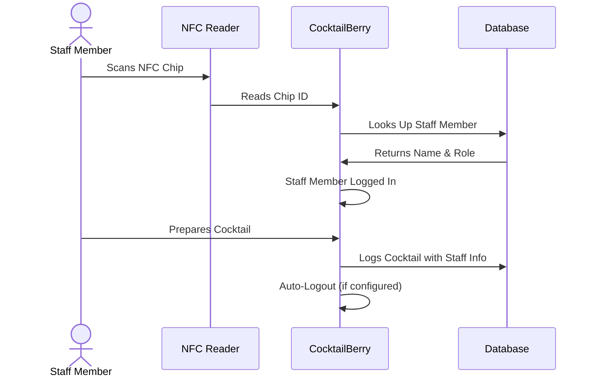

# Service Personnel Mode

!!! info "Optional Feature"
    Service Personnel Mode is an optional feature for operators who want to track which staff member prepared each cocktail and control access to the machine.
    If you don't need staff tracking or per-person access control, you can skip this section.

!!! warning "NFC Reader Conflict"
    Service Personnel Mode and CocktailBerry NFC Payment both require the NFC reader.
    They cannot be enabled at the same time, nor is the initial intent that they would be used together.
    If you need payment functionality, see the [Payment Feature](payment.md) instead.

## Overview

Service Personnel Mode lets you manage who is using your CocktailBerry machine.
Each staff member gets an NFC chip that they scan to log in before they can prepare cocktails.
This gives you two main benefits:

- **Accountability**: Every cocktail is logged with the name of the person who made it, giving you full visibility over your operation.
- **Access Control**: Assign each staff member a role that defines exactly which tabs and option tiles they can use - without sharing the maker or master password.

## Enabling Service Personnel Mode

To enable the feature, activate `WAITER_MODE` in the configuration, you can find it under the software section.
You will need an NFC reader connected to your machine (same hardware as for the [payment](payment.md) feature).
On startup, CocktailBerry validates that the NFC reader is available and disables the mode gracefully if it is not.

??? info "Configuration Options"

    | Setting                        | Description                                          |
    | ------------------------------ | ---------------------------------------------------- |
    | `WAITER_MODE`                  | Enable or disable Service Personnel Mode             |
    | `WAITER_LOGOUT_AFTER_COCKTAIL` | Log out after cocktail preparation                   |
    | `WAITER_AUTO_LOGOUT_S`         | Log out after x seconds of inactivity (0 = disabled) |

## Roles and Permissions

Access is managed through **roles**. A role bundles two kinds of permissions:

- **Tab permissions** (Maker, Ingredients, Recipes, Bottles, Options) - which tabs the person can open, bypassing the maker password for those tabs.
- **Option-tile permissions** - within the Options tab, exactly which tiles (e.g. Cleaning, Configuration, Backup, Reboot) the person can see and use.

Create and edit roles in the **Roles** tab of the Service Personnel management window - for example a "Bar Staff" role with only the Maker tab, or a "Manager" role with broader access.
The **Options** tab permission additionally bypasses the master password, see the [warning below](#password-bypass) for details.

## Registering Staff

Before your staff can use the machine, register their NFC chips:

1. Open the Service Personnel management window from the options menu.
2. When a staff member scans their NFC chip, the scanned ID appears in the management view.
3. Give the person a name and assign them a **role**.

You can change a staff member's name or role at any time from the same window.

## Login and Logout Flow

The typical workflow looks like this:

Once logged in, the staff member can then prepare cocktails, and each preparation is logged under their name.
Logout happens either manually, automatically after a cocktail, or after a configured timeout.

## Difference in Appearance Between v1 and v2

Since we use distinct GUI technologies for v1 (Qt) and v2 (Web), there are some differences in how the logged-in staff member is displayed and how logout works.
See the corresponding section for your version below.

### Logged-in Staff Display and Logout

=== "v1"

    On the maker view, there is no dedicated staff indicator or logout button.
    Logout happens through the configured auto-logout settings or by scanning a different chip.

=== "v2"

    The currently logged-in staff member is displayed as an inline badge on the maker screen, showing their name.
    Clicking the badge reveals a dedicated logout button, allowing the staff member to log out directly.

## Password Bypass

If a staff member's role grants the appropriate tab permissions, they bypass the maker password for the tabs they have access to.
Staff members with the Options permission additionally bypass the master password, granting access to the options menu and other master-password-protected actions like deleting recipes or ingredients.

!!! danger "Grant the Options Permission with Care"
    The **Options** permission is powerful: it lets a staff member into the options menu **without the master password**, and also bypasses the master password for other protected actions (such as deleting recipes or ingredients).

    Access inside the options menu is **granular** - a staff member only sees the specific **option tiles** enabled for their role. You can grant, for example, only *Cleaning* without exposing the rest. Be deliberate about the sensitive tiles, which carry real power:

    - **Configuration** - change any setting
    - **Service Personnel** - create, edit, and delete staff and roles (a person could grant themselves more)
    - **Backup / Restore** and **Software / System Update**
    - **Reboot / Shutdown**

    Only grant this permission - and especially these tiles - to fully trusted and authorized personnel.

In both v1 and v2, a staff member can scan their NFC chip while being prompted for a password.
If they have the required permission, the password dialog is automatically accepted.
Additionally, if a staff member is already logged in before navigating to a protected area, the password prompt is skipped entirely.

## Statistics

Every cocktail prepared while a staff member is logged in is recorded with their name, the recipe, volume, and timestamp.
You can view these logs in the Statistics tab of the Service Personnel management window.
Logs are grouped by date and staff member, showing the total number of cocktails and volume per person per day.
This helps you track performance and accountability across your team.
