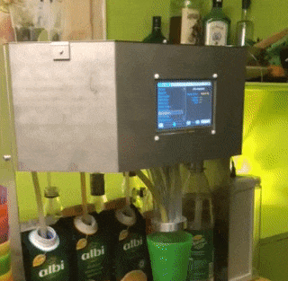
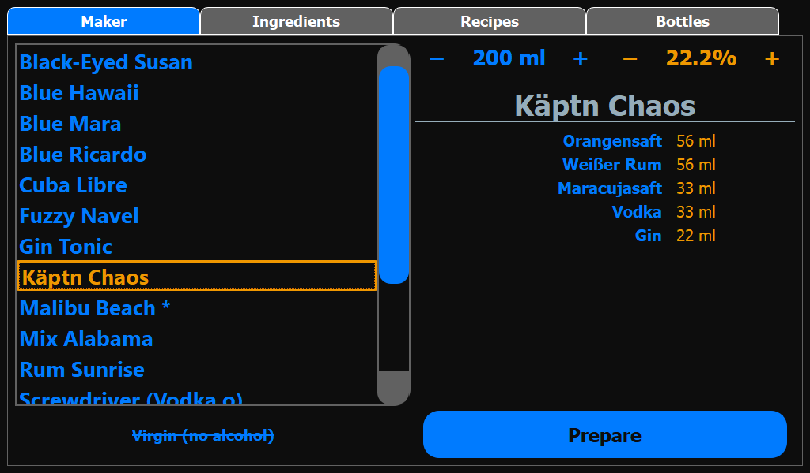
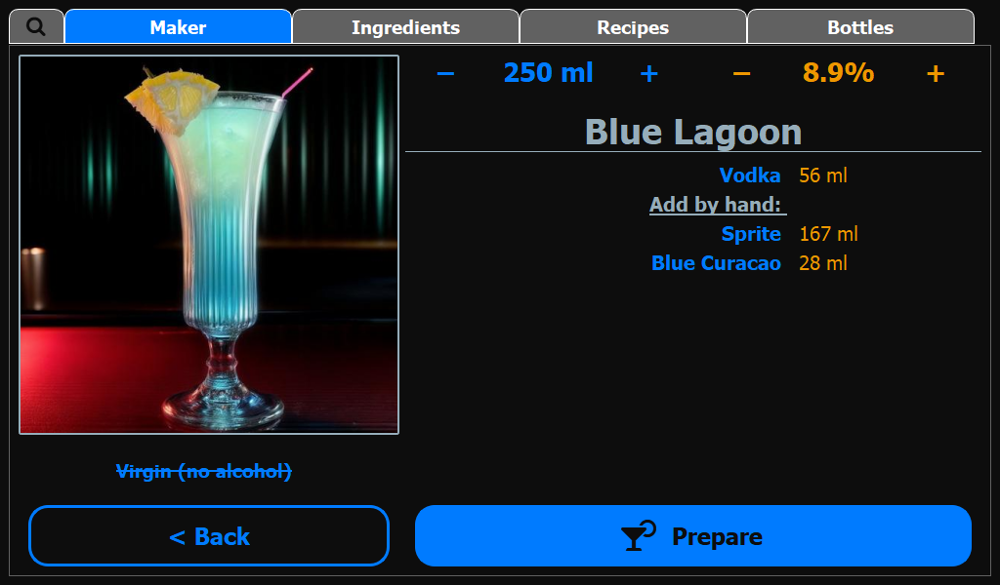
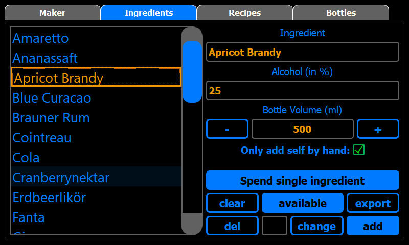
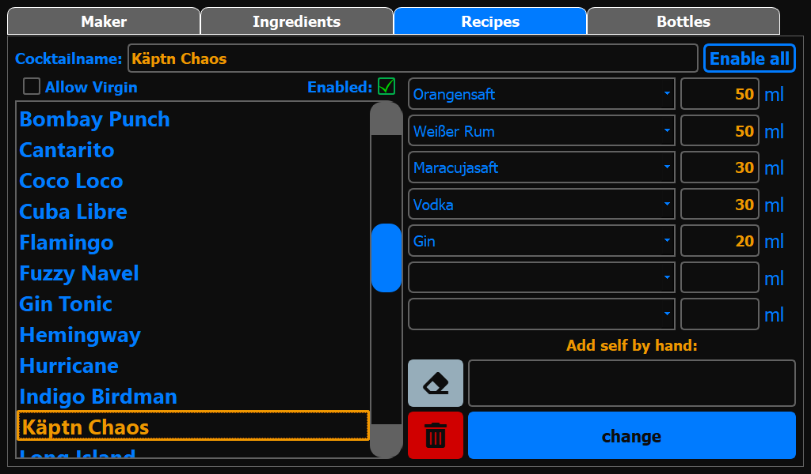
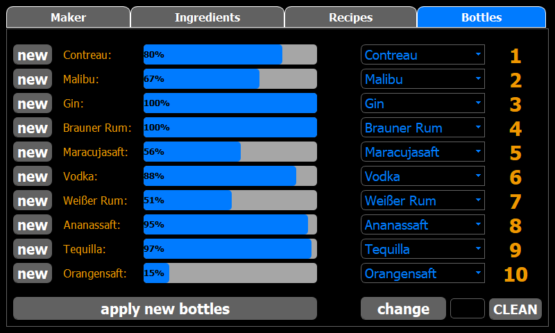

[](https://cocktailberry.readthedocs.io)
[](https://sonarcloud.io/summary/new_code?id=AndreWohnsland_CocktailBerry)


[](https://www.buymeacoffee.com/AndreWohnsland)

CocktailBerry is a Python and Qt based app for a cocktail machine on the Raspberry Pi.
It enables you to build your own, fully customized machine, while still be able to use the identical software on each machine.
Detailed information, installation steps and SetUp can be found at the [Official Documentation](https://cocktailberry.readthedocs.io/).

Supercharge your next party to a whole new level! 🐍 + 🍸 = 🥳 

<a href="https://cocktailberry.org/"></a>
<a href="https://cocktailberry.readthedocs.io/"></a>
<a href="https://stats-cocktailberry.streamlit.app/"></a>

This app is used to control a cocktail machine and easily prepare cocktails over a nice-looking user interface. It also offers the option to create and manage your recipes and ingredients over the interface and calculates the possible cocktails to prepare over given ingredients. Track and display cocktail data for different teams to even further increase the fun. Let's get started!

Like this project? Give it a star on GitHub! ⭐

## tl;dr



# Features

CocktailBerry can do:

- Prepare cocktails of a given volume and adjusted concentration of alcoholic ingredients
- Add new ingredients and recipes with needed information over the UI
- Specify additional ingredients for later hand add within a recipe (like sticky syrup)
- Define connected ingredients to the machine and existing additional ingredients over the UI
- Auto calculates and displays possible recipes dependent on given information
- Supports up to 24 Bottles / Pumps
- Option to serve cocktails without alcohol
- Execute a cleaning program to get rid of remaining fluids
- Export data for later data analysis
- Send cocktail production data to a given endpoint, for example a webhook
- Keep track of cocktail count and volume from different teams for some fun competition
- Select different themes to fit your liking
- Switch between user interface languages
- Support WS281x LEDs on your machine
- Support for RFID/NFC reader
- Implement your own [addon](https://github.com/AndreWohnsland/CocktailBerry-Addons) to extend the base functionality

In addition, there is the possibility to use and set up a second device as a dashboard:

- Provide the teams API to post and get cocktail data
- Display different modes of data for a by team comparison
- _Optional_: Use the dashboard as WiFi hot-spot

# Quickstart

Here are some simple steps to get CocktailBerry running. You need to have **Python 3.9** or newer and **git** installed.

On the RPi, you can try the new [all in one installer script](https://github.com/AndreWohnsland/CocktailBerry/blob/master/scripts/all_in_one.sh). One command should install everything:

```bash
wget -O - https://raw.githubusercontent.com/AndreWohnsland/CocktailBerry/master/scripts/all_in_one.sh | bash
```

Otherwise, run:

```bash
cd ~
git clone https://github.com/AndreWohnsland/CocktailBerry.git
cd CocktailBerry
pip install -r requirements.txt
# you can get help with python runme.py --help
python runme.py
```

This will start the CocktailBerry program. You may want to run the provided installer script for the RPi instead of pip. See [Installation](https://cocktailberry.readthedocs.io/installation/) for more information.

```bash
sh scripts/setup.sh
```

Now you can [Set Up](https://cocktailberry.readthedocs.io/setup/#setting-up-the-machine-modifying-other-values) your CocktailBerry and tweak the settings to your liking.

# Interface

The interface was programmed with PyQt5 for the users to easily interact with CocktailBerry and enter new ingredients/recipes. There are different views for the tasks.

The Maker GUI:





The Ingredient GUI:



The Recipe GUI:



The Bottle GUI:



<br/>

# Pull Requests and Issues

If you want to support this project, feel free to fork it and create your own pull request. If you run into any issues, feel free to open a ticket / issue. If you think there is a super important feature missing, open a feature request. It may be implemented in the future.

# Contributing Possibilities

To get started, have a quick look into the [Guidelines for contributing](./CONTRIBUTING.md). Here is a general list of features or refactoring things, I may do in the future. With your help, these things come even faster! If your idea is not on the list, feel free to open a feature request, I may consider it!

- `easy`: Translate all dialogs / UI to your native language
- `medium`: Help to move to v2 with API based control and a separate UI
- `easy-hard`: Implement a cool [addon](https://github.com/AndreWohnsland/CocktailBerry-Addons) and make it verified

# Development

This project uses [Rye](https://rye.astral.sh/guide/) to manage all its dependencies. To get started, you need to install Rye and then install the dependencies.

```bash
rye sync --no-lock
```

This will install all dependencies and you can start developing. Then just run

```bash
rye run python runme.py
```

If you want to develop the api, you can also run it with

```bash
rye run fastapi dev .\src\api\api.py
```
