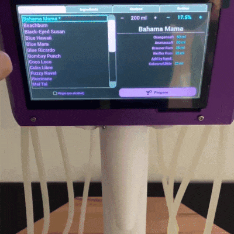
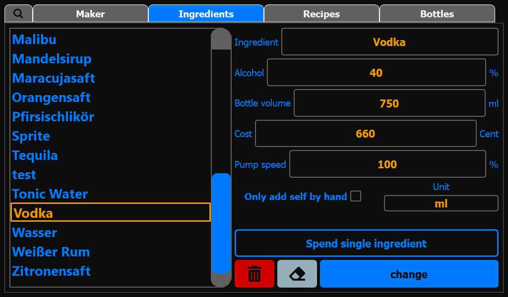
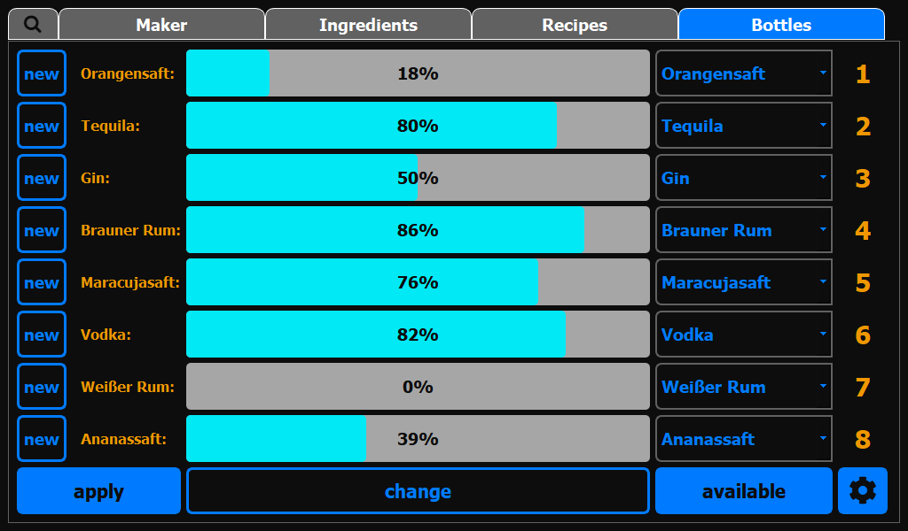

# The Cocktailmaker <!-- omit in toc -->


[](https://sonarcloud.io/summary/new_code?id=AndreWohnsland_Cocktailmaker_AW)


<!--  -->

#### A Python and Qt Based App for a Cocktail Machine 🐍 + 🍸 = 🥳 <!-- omit in toc -->

## Table of Contents <!-- omit in toc -->

- [Overview](#overview)
  - [Features](#features)
  - [The Machine](#the-machine)
  - [Interface](#interface)
- [Hardware](#hardware)
  - [Used Hardware in Showcase Maker](#used-hardware-in-showcase-maker)
  - [Used Hardware in Showcase Teams Dashboard](#used-hardware-in-showcase-teams-dashboard)
- [Installing Requirements](#installing-requirements)
  - [Minimal Requirements](#minimal-requirements)
  - [Install PyQt5 on RaspberryPi](#install-pyqt5-on-raspberrypi)
  - [Install PyQt5 on other Systems](#install-pyqt5-on-other-systems)
  - [Development on Non-Pi Hardware](#development-on-non-pi-hardware)
- [Setting up the Maker](#setting-up-the-maker)
  - [Adding new Recipes or Ingredients](#adding-new-recipes-or-ingredients)
  - [Setting up the Machine / Modifying other Values](#setting-up-the-machine--modifying-other-values)
  - [Calibration of the Pumps](#calibration-of-the-pumps)
  - [Cleaning the Maker](#cleaning-the-maker)
  - [Possible Ingredient SetUp](#possible-ingredient-setup)
  - [Updates](#updates)
- [Supported Languages](#supported-languages)
- [Advanced Topics](#advanced-topics)
  - [Microservices](#microservices)
  - [Dashboard with Teams](#dashboard-with-teams)
  - [Usage of Services](#usage-of-services)
  - [Installing Docker](#installing-docker)
- [Troubleshooting](#troubleshooting)
  - [Problems while Running the Program](#problems-while-running-the-program)
  - [Touchscreen Calibration](#touchscreen-calibration)
  - [Problems Installing Software on Raspberry Pi](#problems-installing-software-on-raspberry-pi)
    - [PyQt can't be Installed](#pyqt-cant-be-installed)
    - [Numpy Import Error at Matplotlib Import](#numpy-import-error-at-matplotlib-import)
    - [How to get the GUI Running on Startup](#how-to-get-the-gui-running-on-startup)
    - [The GUI on the RPi Looks Different from the Screenshots](#the-gui-on-the-rpi-looks-different-from-the-screenshots)
- [Development](#development)
  - [Pull Requests and Issues](#pull-requests-and-issues)
- [Contributing Possibilities](#contributing-possibilities)

# Overview

Welcome to the official documentation of my Cocktail Maker!

This app is used to control a cocktail machine and prepare easily cocktails over a nice-looking user interface. It also offers the option to create and manage your recipes and ingredients over the interface and calculates the possible cocktails to prepare over given ingredients.

tl;dr:



## Features

The Cocktail Maker can do:

- Prepare cocktails of a given volume and adjusted concentration of alcoholic ingredients
- Add new ingredients and recipes with needed information over the UI
- Specify additional ingredients for later hand add within a recipe (like sticky syrup)
- Define connected ingredients to the machine and also existing additional ingredients over the UI
- Auto calculates and displays possible recipes dependent on given information
- Execute a cleaning program to get rid of remaining fluids
- Export data for later data analysis, send data as mail to a receiver
- Send cocktail production data to a given endpoint, for example a webhook
- Keep track of cocktail count and volume from different teams for some fun competition

In addition, there is the possibility to use and set up a second device as a dashboard:

- Provide the teams API to post and get cocktail data
- Display different modes of data for a by team comparison
- _Optional_: Use the dashboard as WiFi hot-spot

## The Machine

The Machine consists out of a Raspberry Pi + touchscreen, 5V relays as well as membrane pumps, cabling and a custom design housing made out of bent, laser cut and welded stainless steel. The electronics are hidden in a waterproof housing, the pumps are within the casing. See [Hardware](#hardware) for a detailed list of components.

Front view:


Side view:


## Interface

The interface was programmed with PyQt5 for the users to easily interact with the maker and enter new ingredients/recipes. There are different views for the tasks.

The Maker GUI:


The Ingredient GUI:



The Recipe GUI:


The Bottle GUI:



# Hardware

You can also run the interface on any non RPi hardware, but you won't be able to control the pins without a device supporting this. To build a functional maker, I provided a list of my used hardware.

## Used Hardware in Showcase Maker

The following component were used within the showcase for the Maker:

- 1x [Raspberry Pi 3b+](http://www.amazon.de/dp/B00LPESRUK/) (or newer like [Model 4](https://www.amazon.de/gp/product/B07TD42S27))
- 1x [5-inch Touch Screen](http://www.amazon.de/dp/B071XT9Z7H/) for the Raspberry Pi
- 1x Micro SD-Card (16 Gb is enough)
- 1x 5V Power supply for the Raspberry Pi
- 1x or 2x [Relay-Boards](https://www.amazon.de/gp/product/B07MJF9Z4K) depending on pump count (important to have 5V input control)
- 6-10x Pumps, depending on your setup (you can use a [peristaltic pump](https://www.amazon.de/gp/product/B07YWGSH3C/) or a [membrane pump](http://www.amazon.de/dp/B07L1FB18S/), it should be food save)
- 1x Power supply for the pumps (a 12V/5A Laptop charger in my case, needs to match pump voltage)
- Food safe hose/tubes for the pumps
- Female to Female jumper wires
- Female to Male HDMI and USB extension cable
- Some wires

## Used Hardware in Showcase Teams Dashboard

The following components were used within the showcase for the Teams Dashboard:

- 1x [Raspberry Pi 3b+](http://www.amazon.de/dp/B00LPESRUK/) (or newer, like [Model 4](https://www.amazon.de/gp/product/B07TD42S27))
- 1x [7-inch Touch Screen](http://www.amazon.de/dp/B014WKCFR4/)
- 1x [Display Casing](http://www.amazon.de/dp/B01GQFUWIC/)
- 1x Micro SD-Card (16 Gb is enough)
- 1x 5V Power supply for the Raspberry Pi

# Installing Requirements

## Minimal Requirements

Disclaimer: since the adding of the new `requirements.txt` file, it should also be possible just to run `pip install -r requirements.txt` in the folder to get all requirements.

```
- Python >= 3.7
- PyQt5, requests, pyyaml, GitPython, typer
- RaspberryPi 3 (older may work but are not tested)
```

It's worth mentioning that I optimized the UI for a touch display with a 800x480 resolution ([this is my display](https://www.amazon.de/gp/product/B071XT9Z7H/ref=ppx_yo_dt_b_asin_title_o05_s00?ie=UTF8&psc=1)). When in dev mode, the full screen is also limited to these dimensions. So usually you won't have any problems with the usual HD or uHD screens. But some screens (like my little 13' Laptop screen) don't show the proper fonts/UI placements. The interface should use your maximum screen size if devenvironment is not activated. If the devenvironment is activated, you can limit width and height to simulate your screen sizes. See [Setting up the Machine / Modifying other Values](#setting-up-the-machine--modifying-other-values) for more information.

## Install PyQt5 on RaspberryPi

You will need at least PyQt5 on your RaspberryPi. More information can be found at [riverbank](https://riverbankcomputing.com/software/pyqt/intro).\
To install PyQt5 on your Pi run:

```
sudo apt-get update
sudo apt-get install qt5-default pyqt5-dev pyqt5-dev-tools
```

## Install PyQt5 on other Systems

If you want to run some testing on other systems, you can get PyQt5 [here](https://www.riverbankcomputing.com/software/pyqt/download5).\
As long as you are using a supported version of Python, you can install PyQt5 from [PyPi](https://pypi.org/project/PyQt5/) by running:

```bash
pip install PyQt5 # if only python3 is installed
pip3 install PyQt5 # if also python2 is installed
```

## Development on Non-Pi Hardware

When you are working on another hardware (for example on a Windows or macOS engine) it is recommended (but not necessary) to set `UI_DEVENVIRONMENT` to `true`. This will enable your cursor, for example. All configuration can be customized under `custom_config.yaml`:

```yaml
UI_DEVENVIRONMENT: true
```

This includes the password (if needed/wanted), the configuration and physical connections of your hardware (like GPIO pin connection and pump volume), the names of the logger and restricted access to some tabs.

# Setting up the Maker

## Adding new Recipes or Ingredients

There are only limited ingredients and recipes. But you can add your own data to the program as well.
This app uses a sqlite3 Database coupled to the UI. So, it's quite easy to implement new ingredients or even recipes.
Just use the implemented UI for the procedure under the according tabs (**Ingredients** or **Recipes**).

All entered values are checked for reason and if something is wrong, an error message will inform the user what is wrong with the data input. If you want to browse through the databse, I recommend some program like [DB Browser for sqlite](https://sqlitebrowser.org/).

## Setting up the Machine / Modifying other Values

These values are stored under the `custom_config.yaml` file. This file will be created at the first machine run and inherit all default values. Depending on your pumps and connection to the Pi, these can differ from mine and can be changed. If any of the values got a wrong data type, a TypeError will be thrown with the message which one is wrong:

- `UI_DEVENVIRONMENT` (_bool_): Boolean flag to enable some development features
- `UI_PARTYMODE` (_bool_): En- or disables the recipe tab (to prevent user interaction)
- `UI_MASTERPASSWORD` (_str_): String for password, Use numbers for build in numpad like '1234'
- `UI_LANGUAGE` (_str_): 2 char code for the language, see [supported languages](#supported-languages) (version >= 1.3)
- `UI_WIDTH` (_int_): Desired interface width, default is 800 (version >= 1.4)
- `UI_HEIGHT` (_int_): Desired interface height, default is 480 (version >= 1.4)
- `PUMP_PINS` (_list[int]_): List of the RPi-Pins where each Pump is connected
- `PUMP_VOLUMEFLOW` (_list[int]_): List of the according volume flow for each pump in ml/s
- `MAKER_NUMBER_BOTTLES` (_int_): Number of supported/displayed bottles. Currently, the UI is build for up to ten bottles
- `MAKER_SEARCH_UPDATES` (_bool_): Boolean flag to search for updates at program start
- `MAKER_CLEAN_TIME` (_int_): Time the machine will execute the cleaning program
- `MAKER_SLEEP_TIME` (_float_): Sleep interval between each UI refresh and check of conditions while generating a cocktail
- `MICROSERVICE_ACTIVE` (_bool_): Boolean flag to post to microservice set up by docker (optional) (version >= 1.1)
- `MICROSERVICE_BASE_URL` (_str_): Base URL for microservice (if default docker it is at http://127.0.0.1:5000) (optional)
- `TEAMS_ACTIVE` (_bool_): Boolean flag to use teams feature (version >= 1.2) (optional)
- `TEAM_BUTTON_NAMES` (_list[str]_): List of format ["Team1", "Team2"] (optional)
- `TEAM_API_URL` (_str_): Endpoint of teams API, default used port by API is 8080 (optional)

Depending on your preferred use, these values can differ. Then just run `runme.py`.

Setting up the machine is quite easy as well. Just go to the **Bottles** Tab and select via the dropdown boxes your assigned ingredients. In addition, you can define ingredients which are also there, but are not connected to the machine (under _Ingredients > available_). You can define ingredients in recipes (at _add self by hand_) which should be later added via hand, for example sticky ingredients which would not be optimal for your pump, or only very rarely used ones in cocktails.

The program will then evaluate which recipe meets all requirements to only show the recipes where even the ingredients added via hand later are available, and the recipe will be shown in the **_Maker_** Tab.

## Calibration of the Pumps

You can use the provided `calibration/calibration.py` script to run a very simple overlay for pump adjustment. Within the file, you can define your used pins (`pinvector`) and the default volume flow provided by the manufacture (`volumeflow`) for the calibration. You can use water and a weight scale for the process. Use different volumes (for example 10, 20, 50, 100 ml) and compare the weight with the output from the pumps. In the end, you can adjust each pump volume flow by the factor:

Vnew = Vold \* expectation/output

<!-- $\dot{V}_{new} = \dot{V}_{old} \cdot \dfrac{V_{expectation}}{V_{output}}$ -->

## Cleaning the Maker

The maker has a build in cleaning function for cleaning at the end of a party. You will find the feature under the `Bottles` tab. To start the cleaning process, the master password is needed to prevent unwanted cleaning attempts. The maker will then go to cleaning mode for the defined time within the config (default is 20 seconds). A message prompt will inform the user to provide enough water for the cleaning process. I usually use a big bowl of warm water to cycle the pumps through one time before changing to fresh water and then running twice times again the cleaning program to fully clean all pumps from remaining fluid.

## Possible Ingredient SetUp

If you are unsure, which ingredients you may need or want to connect to the maker, here is a quick suggestion. You don't need to use all ten slot, but the more you use, the more recipes will be possible:

- Vodka
- White Rum
- Brown Rum
- Orange Juice
- Passion Fruit Juice
- Pineapple Juice
- `optional` Gin
- `optional` Malibu
- `optional` Tequila
- `optional` Grapefruit Juice

In addition, there are some ingredients I would recommend not adding via the maker but by hand, the most important additional ingredients will be:

- Soft Drinks (Cola, Fanta, Sprite)
- Grenadine Syrup
- Blue Curaçao
- Lemon Juice (just a little, you can also use fresh lemons)
- `optional` Cointreau (you may just not add it if not desired)

With this as your base set up, even if not using the optional ingredients, your maker will be able to do plenty of different cocktails.

## Updates

With `version 1.5.0`, there is the option to enable the automatic search for updates at program start. The `MAKER_SEARCH_UPDATES` config can enable this feature. The maker will then check the GitHub repository for new releases and informs the user about it. If accepted, the maker will pull the latest version and restart the program afterwards. The migrator will also do any necessary steps to adjust local files, like the database to the latest release.

# Supported Languages

Version >= 1.3 includes multi-language support. You can change the language with the `UI_LANGUAGE` config option. Currently, supported languages are:

- German (`de`)
- English (`en`)

If you are interested in implementing your own native language, feel free to contact me or submit an according pull request.

# Advanced Topics

## Microservices

As a further addition since `version 1.1`, there is the option to run a microservice within docker which handles some networking topics.
Currently, this is limited to:

- Posting the cocktail name, used volume and current time to a given webhook
- Posting the export CSV as email to a receiver

The separation was made here that a service class within the cocktailmaker needs only to make a request to the microservice endpoint. Therefore, all logic is separated to the service, and there is no need for multiple worker to not block the thread when the webhook endpoint is not up (Which would result in a delay of the display without multithreading). In the future, new services can be added easily to the docker container to execute different tasks. One example of the usage [can be found in my blog](https://andrewohnsland.github.io/blog/cocktail-maker-now-with-home-assistant). The service will also temporary store the data within a database, if there was no connection to the endpoint, and try later again. This way, no data will get lost in the void.

## Dashboard with Teams

With `version 1.2`, there is a team feature implemented into the maker. If enabled within the config, the user can choose one of two teams to book the cocktail and according volume to. The names of the teams, as well the URL of the dashboard device, can be specified within the config. The cocktailmaker will then send the information to the Teams API. The Dashboard will use the API to display the current status in either amount of cocktails or volume of cocktails per team. In addition, there is the option to display all time data of the leader board. By default, the latest 24 hours, so mostly this party, will be shown. You should use a second device for the API / the dashboard for easy display on another screen.


The recommended way is to use a second Raspberry Pi with a touchscreen attached. Then build the docker-compose file and execute the `dashboard/qt-app/main.py`. In before, you should install the `requirements.txt` within the same folder using pip. See [Usage of Services](#usage-of-services) how to set up docker-compose in general. The language can be set within the `dashboard/qt-app/.env` file, codes identical to [supported languages](#supported-languages). Just copy the `dashboard/qt-app/.env.example` file, rename the copy to `.env` and set your desired language.

A second option is to use the `docker-compose.both.yaml` file with the docker-compose `--file` option. This will build up the backend API, as well as a Streamlit frontend Web App. Streamlit is using pyarrow, which the Raspberry Pi 3 (Armv7 Architecture) seems not be able to build without any tweaks. On other architectures (like x86) the container could be build without any problems. If these things confuse you, I strongly recommend using the first recommended option, since you will only lose the possibility to access the dashboard with multiple devices, like a smartphone.

You can also set the second device up as a Wi-Fi hot-spot. This will give you the possibility to always connect to the dashboard, even if no connection to another home network or internet is available. For this, a very easy way is to use [RapsAp](https://raspap.com/).

## Usage of Services

Simply have `docker-compose` installed and run the command in the main folder for the cocktailmaker microservice or in the dashboard folder (on another device) for the dashboard service:

```
docker-compose up -d
```

This will handle the setup of all docker services. You will have to rename the `.env.example` file to `.env` and enter the needed secrets there for the container to work fully.

## Installing Docker

tl;dr: Just run these commands in sequence on the pi and reboot after the first half.

```bash
sudo apt-get update && sudo apt-get upgrade
curl -sSL https://get.docker.com | sh
sudo usermod -aG docker ${USER}
# reboot here
sudo apt-get install libffi-dev libssl-dev
sudo pip3 install docker-compose
sudo systemctl enable docker
# tesing if it works
docker run hello-world
```

# Troubleshooting

## Problems while Running the Program

All cases (e.g. not enough of one ingredient, no/wrong values ...) should be handled, and an info message should be displayed.\
If in any case any unexpected behaviour occurs, feel free to open an issue. Usually, a part of the actions are also logged into the logfiles. When submitting an error, please also provide the `logs/debuglog.log` file.

## Touchscreen Calibration

Sometimes you need to calibrate your touchscreen, otherwise the touched points and cursor are out of sync. First you need to get and compile xinput. After that, you can execute the program and select the crosses on the touchscreen according to the shown order.

```bash
wget http://github.com/downloads/tias/xinput_calibrator/xinput_calibrator-0.7.5.tar.gz
tar -zxvf xinput_calibrator-0.7.5.tar.gz
cd xinput_calibrator-0.7.5
sudo apt-get install libx11-dev libxext-dev libxi-dev x11proto-input-dev
./configure
make
sudo make install
sudo xinput_calibrator # sudo DISPLAY=:0.0 xinput_calibrator may also work
```

To adjust those new touch coordinates, they need to be saved. The xinput program should print out some block beginning with `Section "InputClass"` and ending with `EndSection`. This part needs to be copied to the `99-calibration.conf` file.

```bash
sudo mkdir /etc/X11/xorg.conf.d
sudo nano /etc/X11/xorg.conf.d/99-calibration.conf
```

After the reboot, the calibration should be okay.

## Problems Installing Software on Raspberry Pi

The Raspberry Pi can sometimes differ from other machines in terms of installation. Here are some issues that might occur.

### PyQt can't be Installed

You probably need to run `sudo apt install python3-pyqt5` instead of `pip install pyqt5` on the pi

### Numpy Import Error at Matplotlib Import

Try first running `pip3 install -U numpy` and `sudo apt install libatlas3-base`. If it is still not fixed, try uninstalling and installing numpy / matplotlib again. If really nothing else works, try `sudo pip3 install -U numpy`, then you will probably need to run the python file with root privilege as well, which may result in another GUI style used by the system.

### How to get the GUI Running on Startup

I found the easiest thing is to use RPis Autostart. Create a .desktop file with `sudo nano /etc/xdg/autostart/cocktail.desktop` and the `launcher.sh` in your `/home/pi` folder:

```
[Desktop Entry]
Type=Application
Name=CocktailScreen
NoDisplay=false
Exec=/usr/bin/lxterminal -e /home/pi/launcher.sh
```

```bash
#!/bin/bash
# launcher.sh for dashboard
# no need for sudo if there were no Numpy import errors
sudo python3 /home/pi/Cocktailmaker_AW/dashboard/qt-app/main.py
```

```bash
#!/bin/bash
# launcher.sh for cocktailmaker
python3 /home/pi/Cocktailmaker_AW/runme.py
```

If your setup is equal to mine (Raspberry Pi, Maker GitHub cloned to `/home/pi/` folder) you can also just copy the files and comment/uncomment within the launcher.sh to save some typing:

```bash
cp /home/pi/Cocktailmaker_AW/launcher.sh /home/pi/
cp /home/pi/Cocktailmaker_AW/cocktail.desktop /etc/xdg/autostart/
```

If there are any problems with the lxterminal window opening and instant closing, check the rights of the shell file, it needs executable (x) rights, otherwise use `chmod` to give x-rights:

```bash
sudo chmod +x /home/pi/launcher.sh
# or
sudo chmod 755 /home/pi/launcher.sh
```

### The GUI on the RPi Looks Different from the Screenshots

I've noticed when running as root (sudo python3) and running as the pi user (python3) by default the pi will use different GUI resources. Using the pi user will result in the shown interfaces at the cocktailmaker (and the program should work without root privilege). Setting the XDG_RUNTIME_DIR to use the qt5ct plugin may also work but is untested.

# Development

For developers, there is [an additional section](docs/devnotes.md) with information available. See this docs for further information like the program schema or framework specific development problems.

## Pull Requests and Issues

If you want to support this project, feel free to fork it and create your own pull request. If you run into any issues, feel free to open a ticket / issue. If you think there is a super important feature missing, open a feature request. It may be implemented in the future.

# Contributing Possibilities

To get started, have a quick look into the [Guidelines for contributing](./CONTRIBUTING.md). Here is a general list of features or refacturing things, I may do in the future. With your help, these things come even faster!

- `easy`: Translate all dialogs / UI to your native language
- `hard`: Use an ORM instead of default SQL language
